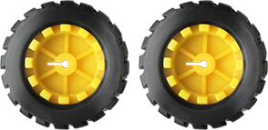
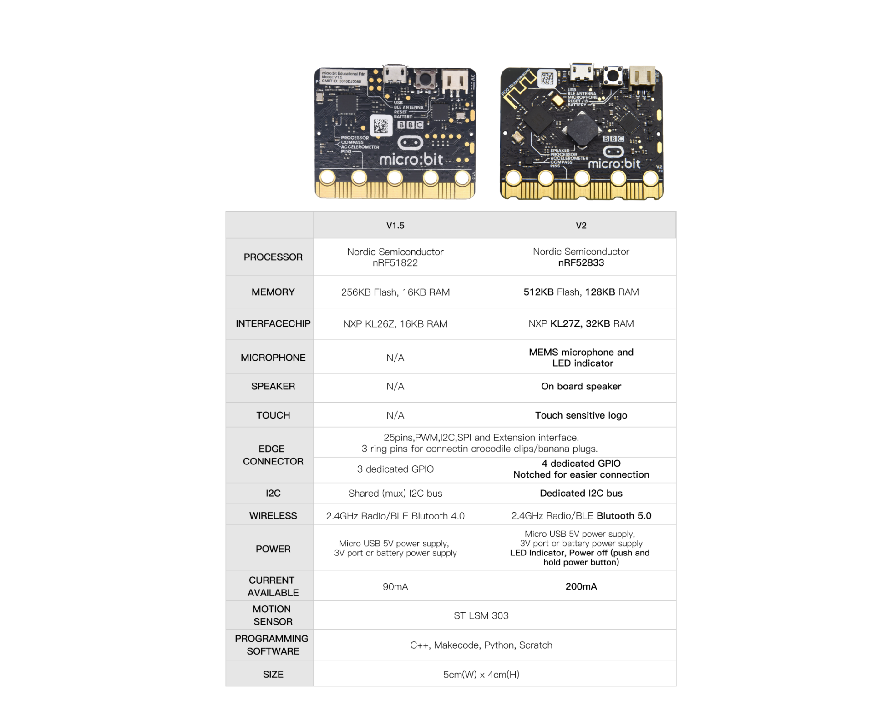

# 前言 

您想学习编程还是拥有自己的编程机器人？目前，编程已发展到较低年龄组，每个人都能编程将会是一种趋势。从micro：bit到Arduino和Raspberry Pi，简单的图形编程使每个人编程成为可能。也许您没有听说过，没关系，使用此产品和教程，您可以轻松完成一个多功能编程小车，并体验作为Maker的乐趣。

micro:bit作为一款高度集成化、尺寸小巧、携带方便、功能强大且简单的的微型控制器，非常适合中小学生在STEAM教育的课程中使用，通过图形化和代码结合的编程方式可以制作机器人、可穿戴设备、电子互动游戏等。  
这个迷你智能小车是专门为micro:bit设计的智能DIY小车(请注意本套件不包含micro:bit主板)，小车由具有扩展功能的车体，2个减速直流马达，车轮，传感器以及亚克力等组成。这样你就可以自己动手轻松地组装出一台酷炫的micro:bit小车，然后通过微软（Microsoft）的线上图形化编程平台Make Code 给micro:bit控制板编写程序来控制小车，在体验造物的过程中，增强动手能力，学习编程技巧。MakeCode for micro:bit是micro:bit官网上使用最为广泛的图形化编程环境，它基于微软开源项目MakeCode开发的图形化编程环境。Make Code图形化编程，还可以转换为python或javascript，代码与图形化结合，非常方便易学。同时，Make Code编程可以仿真，也可以给实际的电子元件编程。  
在本学习套件的每个学习章节中，我们都提供程序源代码，其中包含详细的代码程序说明和代码编写步骤。这样，您就可以真正理解程序各部分的含义。

# 产品说明

本产品就是一款以Micro bit为控制中心的DIY
小车。它集成了超声波和红外避障功能，[循迹](https://www.baidu.com/link?url=thKWXMYw_4f_yoJ9WKgXowXo1JMpK3hk9d97Lwlgip2bOyxJdcGzOeX9LLQbGjJOYjZkCNPgjlihkWwFpQrSCPVf4BB7ozNANwDKndVA4Wu&wd=&eqid=c122c9130001b634000000045eeb310e)功能，红外控制功能和蓝牙控制功能。它自带一个无源蜂鸣器，可以使用Micro bit的音乐播放功能；自带一个KEYES-2812-18R模块，可以控制模块上18个RGB灯显示不同颜色；自带1个光敏电阻，可以检测环境光的强度，控制小车上其它元件的状态，如KEYES-2812-18R模块；自带2个RGB灯（LED2和LED3），可以制作小车的2个方向灯。同时它带有充电功能，本产品使用一个18650供电，当电量不足时直接连接电源充电即可，支持边冲边放；安装和拆装电池时注意电池的正负极，务必不要把电池的正负极接反。本产品的电机速度是可调。

为了方便你更快熟悉产品，我们还提供对应的安装文件，及实验代码。

# 规格参数

电压：DC 5V

电流：电脑USB供电或者大于等于2A输出能力的电源

最大功率：最大输出功率为10W

工作温度范围：0-50℃

尺寸：120\*90.7mm

环保属性：ROHS

# 产品清单

电子组件

|编码|规格型号|数量|图片|
|-|-|-|-|
|1|keyes Micro:bit mini smart robot car 扩展板V2黑色环保|1||
|2|HC-SR04超声波传感器|1||
|3|KEYES-2812-18R模块（焊黄色弯针）|1||
|4|micro：bit 主板|1||

结构部分
|4|keyes Micro：bit mini smart robot car kit V2亚克力套件3片T=3MM|1||
|-|-|-|-|
|5|N20马达专用车轮直径：43mm 宽度：19mm 孔径：3mm D型孔 ABS塑料+橡胶黄色|2||
|6|Arduino 3PI miniQ小车万向球 304不锈钢 W22*H15MM|1||
|7|绝缘垫片|3|
|8|Micro:bit USB线A/MICRO OD：4.0 黑色带磁簧 L=1.2米 环保|1||
|9|公对母10CM/40P/2.54/10股铜包铝 24号线BL|3||
|10|公对母15CM/40P/2.54/10股铜包铝 24号线BL 环保|4||

螺丝螺母
|11|M1.6*10MM 圆头 十字螺钉|8||
|-|-|-|-|
|12|M3*6MM 圆头 螺钉|8||
|13|M1.6 304不锈钢 螺母|8||
|14|双通M3*35MM六角铜柱|4||
|15|M3*10MM 平头 螺钉|1||
|16|M3 镀镍 螺母|1||
|17|M2.5*10MM 圆头 十字 自攻螺丝 不锈钢|2||
|18|M2*12MM 圆头 十字|6||
|19|M2 镀镍|6||

工具
|20|手柄颜色黄黑3*40MM十字螺丝刀|1||
|-|-|-|-|
|21|循迹轨迹图|1||
|22|手柄颜色蓝黑色2*40MM一字螺丝刀|1||
|23|电池|1||
|24|遥控器|1||

# 初次使用前的准备：

## 1.关于BBC Micro:bit

（1）Micro:bit是什么?

Micro:bit主板是英国广播公司设计的，旨在帮助7年级（11-12岁）及以上的孩子更好地学习编程。Micro:bit主板拥有丰富的板资源，包括一个5\*5 LED点阵、2个可编程按钮、指南针、Micro USB端口、蓝牙模块等。它只有信用卡一半大小(4cm×5cm)，但功能非常强大。它可以用于编写电子游戏，声光互动，机器人控制，科学实验，可穿戴装置开发等，可以实现任何酷炫的小发明，无论是机器人还是乐器，没有做不到只有想不到。

新款的Micro:bit V2主板上有一个可触摸感应的Logo和MEMS麦克风。背面还添加了一个蜂鸣器，这样就可以在没有外部设备的情况下播放各种声音。底部的金手指加上齿轮设计，方便用户更好地固定鳄鱼夹。此外，Micro:bit V2主板还支持休眠模式，用户可以长按Micro:bit V2主板后面的复位&电源按钮，使其进入睡眠模式，降低电池功耗。最重要的特点是Micro:bit V2主板的CPU性能比V1.5版本好得多，外加更多的RAM。所以Micro:bit V2允许用户扩展更多的功能，创造更多的创意作品。

（2）Micro:bit主板硬件分布图介绍：

Micro:bit V2主板

Micro:bit V1.5主板

Micro:bit V2主板与Micro:bit V1.5主板的比较：

在新款Micro:bit V2主板上按下复位&电源按钮将重置micro:bit并重新运行程序。如果你按住它，红色的LED就会慢慢褪色。当电源指示灯变暗时，松开按钮，你的micro:bit主板就会进入省电睡眠模式。通过这种方法可以让你的电池用的更持久，再次按下此按钮可以来唤醒你的Micro:bit。

有关更多内容，请参阅：<https://tech.microbit.org/hardware/>

[https://microbit.org/new-microbit/](https://microbit.org/new-microbit/)

[https://www.microbit.org/get-started/user-guide/overview/](https://www.microbit.org/get-started/user-guide/overview/)

[https://microbit.org/get-started/user-guide/features-in-depth/](https://microbit.org/get-started/user-guide/features-in-depth/)

（3）Micro:bit引脚配置介绍，如下图所示：

 

 Micro:bit V2主板 Micro:bit V1.5主板

详细信息请参考官方网站：<https://tech.microbit.org/hardware/edgeconnector/>

[https://microbit.org/guide/hardware/引脚/](https://microbit.org/guide/hardware/pins/)

（4）新款Micro:bit V2主板使用注意事项：

- a. Micro:bit   V2主板上有很多精密的电子元件，建议戴上硅胶保护套进行使用，防止短路。

- b. Micro:bit   V2主板的IO口驱动能力很弱，IO口电流不足300mA，请勿接大电流器件（例如大舵机MG995、直流电机），否则会烧坏Micro:bit   V2主板，使用前必须完全了解清楚你所使用的器件电流情况，一般建议配搭Micro:bit扩展板进行使用。

- c. 供电建议从Micro:bit   V2主板的USB口进行供电，或者Micro:bit V2主板上的3V电池座接口。Micro:bit   V2主板本身IO口是3V电平，所以是不支持5V传感器的，如需支持5V传感器需要使用
  Micro:bit扩展板。

- d. 使用与Micro:bit   V2主板LED点阵的共用引脚（如P3、P4、P6、P7、P10），记得在代码中把LED点阵禁用掉，否则会有LED点阵显示杂乱和可能让所接传感器数据出错的现象。

- e.   3V电池座接口上不能使用超过3.3V电池，否则很容易会把Micro:bit   V2主板烧坏。

- f. 禁止放在金属制品上使用，以免发生短路。

总结：Micro:bit V2主板就像是一台微型计算机，它使编程变得有形，并促进数字创造力。关于编程环境，BBC提供了一个在线编程网站：<https://microbit.org/code/>，该网站有一个易于使用的图形化程序MakeCode。

## 2.Micro:bit驱动安装说明：

如果你已经安装过micro:bit
驱动，就不需要再次安装micro:bit驱动。假如你是首次使用micro:bit主板，则你的电脑需要安装micro:bit驱动，我们提供的micro:bit驱动文件

和micro:bit驱动安装手册都在文件夹“Micro:bit
驱动程序下载安装”里面，你可以进入相关文件夹中根据micro:bit驱动安装手册中的说明来安装micro:bit驱动。

# 迷你智能机器人小车

本小节将介绍keyes micro:bit迷你智能机器人小车的功能和结构。

keyes micro:bit迷你智能机器人小车是一款可编程小车，它基于BBC micro：bit。
它采用大部分集成设计，因此您不需要很复杂的接线

并且易于使用。
它具有超声波传感器，红外避障传感器，循迹传感器，光敏电阻。
它还具有无源蜂鸣器，RGB LED，KEYES-2812-18R模块和其他外围设备。
丰富的硬件资源将使您掌握更多的知识和技能。
您可以利用自己的想象力创造更多的科技发明。

## 1.遇见keyes micro:bit迷你智能机器人小车

keyes micro:bit迷你智能机器人小车是一款基于BBC micro：bit的多功能小车。
它具有丰富的传感器和外围设备，可帮助您进一步学习如何使用micro：bit和有关电子的知识。

特征

keyes micro:bit迷你智能机器人小车的传感器/元件和micro：bit引脚之间的连接：

充电电池

keyes micro:bit迷你智能机器人小车由1个18650电池供电，小车扩展板的电池座可以与任何类型的18650电池兼容。您可以使用
micro USB端口或通用USB充电器为电池充电，最大充电电流为700 mA。

请注意：此产品不含电池。

指示器

一些LED集成在小车扩展板上，每个LED状态指示相应的内容。
您可以通过它们更好地了解keyes micro:bit迷你智能机器人小车的工作状态。

|LED|指示内容|LED亮|LED不亮|
|-|-|-|-|
|D2|左边循迹传感器|检测到白色物体|检测到黑线物体|
|D6|右边循迹传感器|检测到白色物体|检测到黑线物体|
|SIG1|左边避障传感器|检测到障碍物|未检测到障碍物|
|SIG2|右边避障传感器|检测到障碍物|未检测到障碍物|
|POW|电源指示|||
|LED1|充电或未充电状态，连续闪烁几次，则表示当前电压为几V。例如，连续闪烁4次，则表示当前电池电压为大于或等于4V，当充满电时LED1常亮。|

电位器

|电位器|调节内容|调节敏感度|
|-|-|-|
|RP1|右边循迹传感器|顺时针调，循迹距离减少，反之增大；在小车底部放上白纸，通过旋转小车扩展板前方的电位器（RP1），当小车扩展板上D2指示灯亮起时，再拿起小车使小车扩展板上的万向轮离白纸的高度大概0.5cm，小车扩展板上D2指示灯熄灭，这时灵敏度就调节好了|
|RP2|左边循迹传感器|和电位器RP1相同|
|RP5|左边避障传感器|左边避障传感器正对着障碍物一段距离（大概5cm），通过旋转小车扩展板上的电位器（RP5），当小车扩展板上SIG1指示灯亮起时，再移开障碍物，SIG1指示灯熄灭，这时灵敏度就调节好了。|
|RP9|右边避障传感器|右边避障传感器正对着障碍物一段距离（大概5cm），通过旋转小车扩展板上的电位器（RP9），当小车扩展板上SIG2指示灯亮起时，再移开障碍物，SIG2指示灯熄灭，这时灵敏度就调节好了。|

## 2.keyes micro:bit迷你智能机器人小车组装

1. 安装micro:bit 迷你智能机器人小车底板

（需要将万向轮中的2个自攻螺钉取出，这里使用的2个M2.5\*10MM自攻螺钉是另外提供，而不是万向轮中的自攻螺钉。同时安装时，2个M2.5\*10MM自攻螺钉不能扭太紧）

1.  安装micro:bit 迷你智能机器人小车顶板

（注意：亚克力上面的保护膜需要先撕掉再组装）

准备以下材料：

M1.6螺母\*6 KEYES-2812-18R模块\*1

M3螺母\*1 HC-SR04 超声波模块\*1

亚克力板2\*1 M3\*10MM 螺钉\*1

亚克力板3\*1 M3\*6MM 螺钉\*4

白色垫片\*2 M1.6\*10MM 螺钉\*6

2.  接线

|传感器/模块|模块上引脚|底板上引脚|
|-|-|-|
|KEYES-2812-18R模块|G|G|
|V|V|
|D1|D5|
|HC-SR04超声波传感器模块|Gnd|G|
|Echo|D15|
|Trig|D14|
|Vcc|5V|

3.  安装micro:bit（LED点阵朝车前）

完整的keyes micro:bit迷你智能机器人小车

