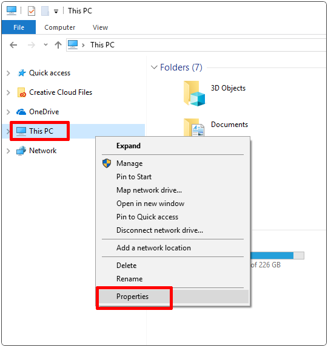
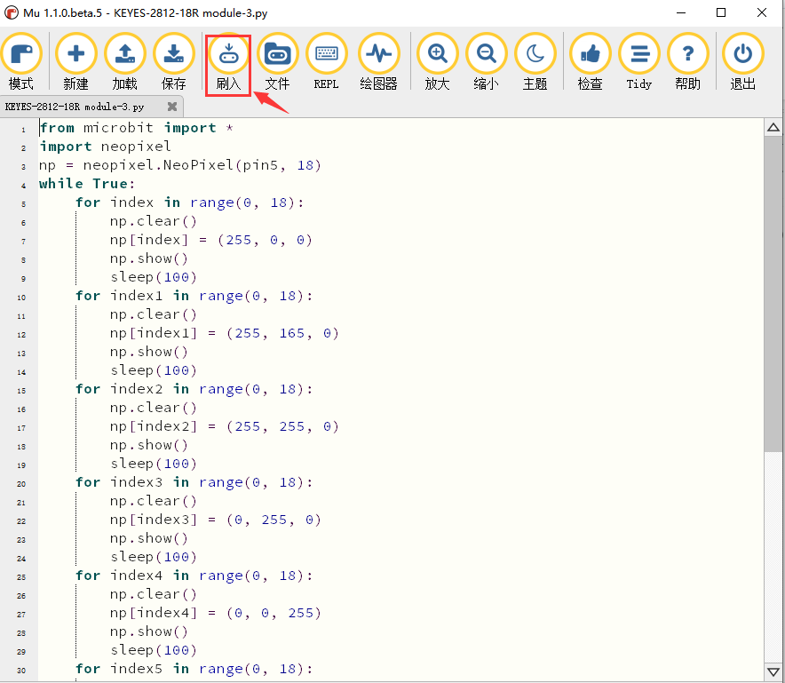
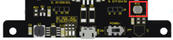
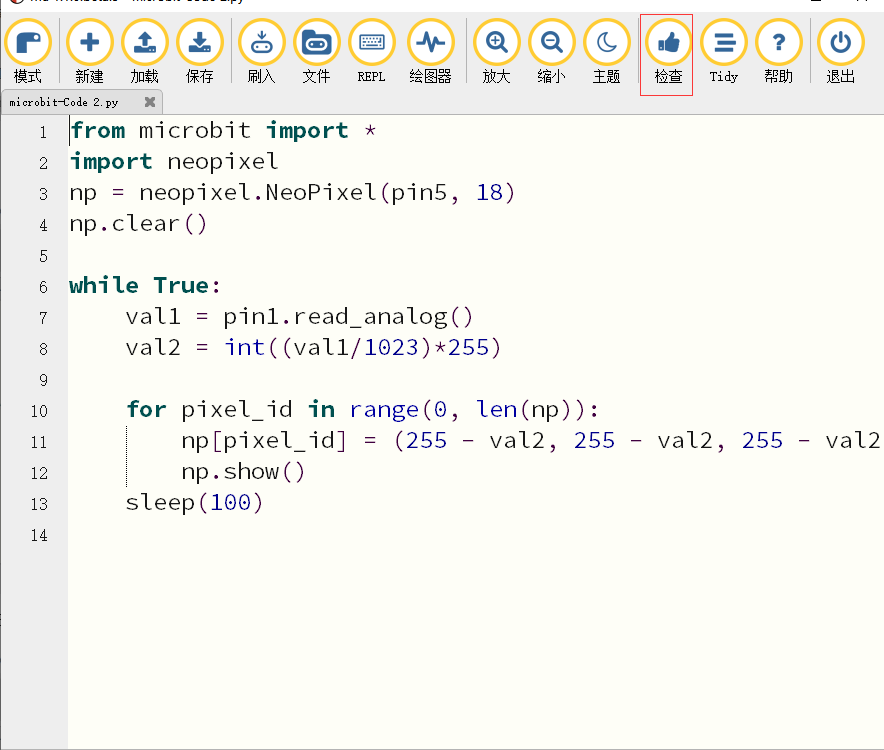
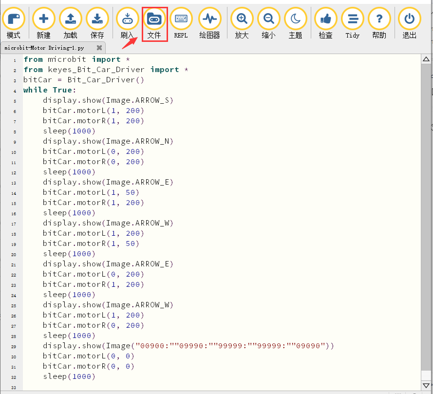
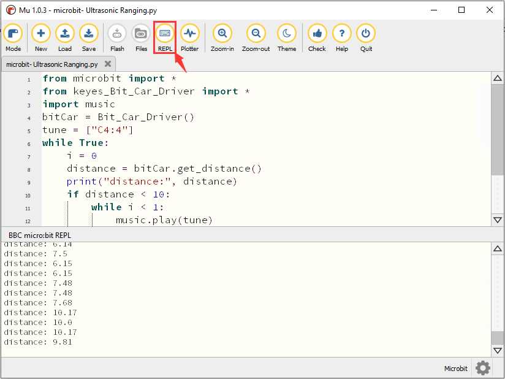
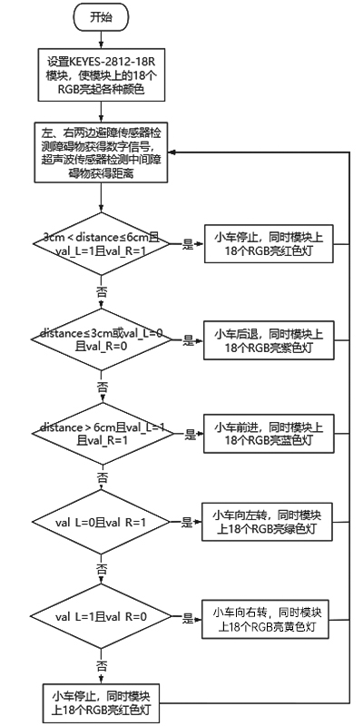

# Python 教程

以下的步骤说明基于Windows操作系统，如果你使用的是其他操作系统，可以将其作为参考。

本教程是为Python语言编写的，如果想要使用图形化代码编程，请参阅手册”Makecode教程”。在您下载的资源的根目录中，有一个名为“Python测试程序”的文件夹，其中保存了“Python 教程
”中的所有Python代码，Python代码文件是以“.py”结尾的文件。

### Python

Python是一种基于文本的语言，广泛应用于教育领域，也被数据科学和机器学习等领域的专业程序员使用。在庞大的教育者和计算专家社区的支持下，Python是继图形化编程之后的一个伟大的编程语言工具，是对基于文本编程的完美引入。

micro：bit可以用Python语言编程。由于micro：bit是一个微控制器，硬件的不同使得micro：bit不能完全支持Python。这里有一个是MicroPython，它是专门为micro：bit设计的，MicroPython是python3编程语言的一个精简而高效实现，它包含Python标准库的一小部分，并且经过优化，可以在micro：bit微控制器上运行。BBC micro:bit使用的Python版本称为MicroPython。
非常适合那些想要继续深入学习编程的人群，用一系列代码段、各种预制图像和音乐帮助你进行编程。BBC microbit MicroPython的官方说明链接：<https://microbit-micropython.readthedocs.io/en/latest/tutorials/introduction.html>

Python代码有两种类型的编辑器（web版和离线版）。

1.  Python代码编辑器的web版本（Micro:bit官方链接）如下：<https://python.microbit.org/v/1.1>

Micro:bit官方在线代码编写平台，使用常用浏览器直接打开上述网址即可使用。

2.  Micro:bit官方也推出了一个离线的编译工具Mu，方便在没有网络连接的时候也可以进行创意和教学

。对于Windows和MAC用户，可以使用独立软件Mu(离线的编译工具)     。 (Mu软件下载链接：<https://codewith.mu/en/download>)

本教程也基于在本地离线模式使用Mu软件作为Python代码编辑器来完成项目实验。

Mu

Mu的官方网站：<https://codewith.mu/>

Mu是一个面向初学者程序员的Python代码编辑器，它基于教师和学生。获得Mu最简单和最容易的方法是通过Windows或Mac OSX的官方安装程序(Mu不再支持32位Windows)。目前推荐的版本是Mu 1.1.0-beta 2。建议你们通过每个支持的操作系统的链接更新到这个版本.

步骤1-确定版本并且下载Mu安装程序

先了解您的计算机是Windows系统还是Mac OSX系统；再打开资源管理器，鼠标右键点击”此电脑”，并选择属性，了解您的Windows系统是32位还是64位。

查看系统类别，类型将显示在操作系统下，64位系统或者32位系统：

打开链接：<https://codewith.mu/en/download>下载对应的Mu软件版本。

步骤2-运行安装程序：

找到你刚刚下载的安装程序（它可能在你的下载文件夹中），双击打开安装程序文件。

这里我们概述了在windows10上的Windows安装Mu所需的额外步骤（Windows的其他版本也将类似）。

Mac OSX系统安装Mu方法对应链接：<https://codewith.mu/en/howto/1.1/install_macos>
。

Windows 10 系统

Windows Defender将弹出一条警告消息。你应该点击“更多信息”链接。

消息将更改，提供有关安装程序的更多信息，并显示“Run anyway”按钮。单击“Run anyway”按钮。

步骤3-许可协议

检查许可证，选择复选框并单击“Install”。

步骤4-安装

当Mu在你的电脑上安装时，需要几秒钟。

第5步-完成

安装已成功完成，请单击“完成”关闭安装程序。

第9步-启动Mu

你可以点击开始菜单中的图标启动Mu，也可以在搜索框中输入Mu(下面两种方法都有显示)。在第一次开始时，这可能需要一些时间。

Mu的主界面如下图所示：

### 资源和代码

该工具包的资源和代码可以在下面下载：https://pan.baidu.com/s/1wbJroxGKyMOwSZdBn8SNHA   
提取码：jfpp

下载并解压缩后，将生成一个名为“KE3023(KE3024) Microbit Mini Smart Robot Car
迷你智能机器人小车V2“的文件，您可以将其放在电脑磁盘上的任何位置。

## 小车的课程介绍

实验8.1至8.12是使用micro：bit主板自带的传感器模块和LED点阵。

### 1：闪烁的心

1.  实验说明：

首先先来练习一个不需要其他辅助元件，只需要一块micro：bit主板和一根micro USB数据线的简单实验，让micro：bit显示“闪烁的心”，这是一个让micro：bit主板和PC机通信的实验，这也是一个入门实验，希望可以带领大家进入micro：bit的魔幻世界。

2.  准备：

（1）通过micro USB线连接micro：bit和电脑。

（2）打开离线版本的Mu软件。

3.  实验代码：

打开Mu软件，点击菜单栏中
“模式“按钮并在弹出对话框中选择“BBC micro：bit”之后，单击“OK”。

点击“加载”按钮，选择“microbit-Heartbeat.py”文件，然后单击“打开”。加载文件路径如下表所示：

|文件类型|路径|文件名|
|-|-|-|
|Python file|..../2. Python 教程\Python 测试程序\8.1：闪烁的心|microbit-Heart beat.py|

除了上述Mu软件加载（导入）代码方法之外，还有一种更简单的加载代码方法：先打开Mu软件，然后选中“microbit-Heart beat.py”文件，并继续按下鼠标左键，将选中的文件拖动到Mu软件中。

成功加载如下所示。你也可以自己在编辑窗口输入代码。（注意！所有英文及符号均须以英文填写，最后一行必须有空格。）

以下是内置图像的列表：

• Image.HEART

• Image.HEART_SMALL

• Image.HAPPY

• Image.SMILE

• Image.SAD

• Image.CONFUSED

• Image.ANGRY

• Image.ASLEEP

• Image.SURPRISED

• Image.SILLY

• Image.FABULOUS

• Image.MEH

• Image.YES

• Image.NO

• Image.CLOCK12, Image.CLOCK11, Image.CLOCK10, Image.CLOCK9, Image.CLOCK8, Image.CLOCK7, Image.CLOCK6, Image.CLOCK5,

Image.CLOCK4, Image.CLOCK3, Image.CLOCK2,Image.CLOCK1

• Image.ARROW_N, Image.ARROW_NE, Image.ARROW_E, Image.ARROW_SE, Image.ARROW_S, Image.ARROW_SW, Image.ARROW_W, Image.ARROW_NW

• Image.TRIANGLE

• Image.TRIANGLE_LEFT

• Image.CHESSBOARD

• Image.DIAMOND

• Image.DIAMOND_SMALL

• Image.SQUARE

• Image.SQUARE_SMALL

• Image.RABBIT

• Image.COW

• Image.MUSIC_CROTCHET

• Image.MUSIC_QUAVER

• Image.MUSIC_QUAVERS

• Image.PITCHFORK

• Image.PACMAN

• Image.TARGET

• Image.TSHIRT

• Image.ROLLERSKATE

• Image.DUCK

• Image.HOUSE

• Image.TORTOISE

• Image.BUTTERFLY

• Image.STICKFIGURE

• Image.GHOST

• Image.SWORD

• Image.GIRAFFE

• Image.SKULL

• Image.UMBRELLA

•
Image.SNAKE，Image.ALL_CLOCKS，Image.ALL_ARROWS

通过micro USB线连接micro：bit和电脑，点击“刷入”按钮将代码下载到micro：bit。

如果代码有错误，也可以将代码成功下载到micro：bit，但无法正常工作。如果sleep写为sleeps，点击“加载”按钮，代码也会被下载到micro：bit。

下载完成后，led矩阵提示一些错误信息，以及错误的行号。点击“REPL”按钮之后，再按下micro：bit的重置按钮（背面的复位按钮，不是A、B按键），错误信息将显示在REPL框中，如下所示：

再次单击“REPL”按钮，将关闭REPL模式，然后你就可以刷新新代码了。为了确保代码正确，完成代码后，单击“检查”按钮检查代码是否有错误。如下图所示，点击“检查”按钮，然后Mu将指示代码的错误。

根据错误提示，正确修改代码。然后再点击“检查”按钮，Mu在下面的栏上显示没有问题。

有关使用Mu的更多教程，请参阅：<https://codewith.mu/en/tutorials/>

4.  实验结果:

代码完成之后，经过点击“检查”按钮检查代码无误后，再点击“刷入”按钮，将代码上传到micro：bit，micro USB数据线不要拔下来，利用micro USB数据线上电，就可以看到micro:bit上的LED点阵屏循环显示“❤”图案和“

”图案。

### 2：LED点阵中单个LED显示

1.  实验说明：

micro：bit主板的LED点阵共由25个发光二极管组成，5个一组，分别对应X和Y方向，形成一个5×5的矩阵，且每个发光二极管是放置在行线（X）和列线（Y）的交叉点上，我们可以通过设置坐标点来实现对25个LED中某一个LED的控制。例如，想要LED点阵中第1行第1个LED点亮，可以设置坐标点为（0，0）；第1行第3个LED点亮，可以设置坐标点为（2，0）；第1列第5个LED点亮，可以设置坐标点为（0，4）；第3列第2个LED点亮，可以设置坐标点为（2，1），依此类推。

2.  准备：

（1）通过micro USB线连接micro：bit和电脑。

（2）打开离线版本的Mu软件。

3. 实验代码：

用Mu软件打开“microbit-LED点阵中单个LED显示.py“文件，加载代码的路径如下：

|文件类型|路径|F|
|-|-|-|
|Python file|../2. Python 教程\Python测试程序\8.2：LED点阵中单个LED显示|microbit-Light up an LED .py|

加载完成后，如下图所示，你也可以打开Mu软件，在编辑窗口输入代码。（注意！所有英文及符号均须以英文填写，最后一行必须有空格。）

您需要单击“检测”按钮来检查代码是否有错误。如果一行出现光标或下划线，则表明该行的程序有错误。

确定程序代码无误之后，你还需要确定micro USB线已连接到micro:bit和电脑，然后单击“刷入”按钮将代码下载到micro:bit。

4.实验结果：

代码成功下载到micro：bit 之后，micro USB数据线不要拔下来，利用micro USB数据线上电，就可以看到micro:bit上处于坐标点(1,0)的LED的亮灭状态，持续0.5s；再次切换坐标点(3,4)的LED的亮灭状态，持续0.5s。循环进行。

6.  参考文献：

关于休眠（延时）功能的细节，请参考链接[:
https://microbit-micropython.readthedocs.io/en/latest/utime.html](E:\\readthedocs keyes\\KE3023 Keyes Microbit Mini Smart Robot Car 迷你智能机器人小车V2（含主板）\\docs\\2. Python 教程\\ https:\\microbit-micropython.readthedocs.io\\en\\latest\\utime.html)

### 3：5\* 5 LED点阵图案显示

1.  实验说明：

点阵在我们生活中很常见，很多都有用到它，比如LED广告显示屏，电梯显示楼层，公交车报站等等。

micro：bit主板的LED点阵共由25个发光二极管组成，上一课我们已经讲过通过设置坐标点来实现对LED点阵的25个LED中的某个LED的控制，这样可以通过设置多个坐标点控制多个LED的亮灭使得LED点阵能够显示图案、数字、字符串。我们也可以在特定代码中通过点击
LED点阵的灰白色小正方形点亮
LED点阵对应的LED来实现LED点阵显示图案、数字、字符串。除了上述方法还可以使用自定义图案使LED点阵显示图案。

2.  准备：

（1）通过micro USB线连接micro：bit和电脑。

（2）打开离线版本的Mu软件。

3. 实验代码：

代码1：

用Mu软件打开“microbit-5×5 LED Dot Matrix-1.py“文件，加载代码的路径如下：

|文件类型|路径|文件名|
|-|-|-|
|Python file|../2. Python 教程\Python 测试程序\8.3：5 5 LED点阵图案显示|microbit-5× 5 LED Dot Matrix-1.py|

加载完成后，如下图所示。你也可以打开Mu软件，在编辑窗口输入代码。（注意！所有英文及符号均须以英文填写，最后一行必须有空格。）

您需要单击“检查”按钮来检查代码是否有错误。如果一行出现光标或下划线，则表明该行的程序有错误。

确定程序代码无误之后，你还需要确定micro USB线已连接到micro:bit和电脑，然后单击“刷入”按钮将代码下载到micro:bit。

代码2：

用Mu软件打开“microbit-5×5 LED Dot Matrix-2.py“，加载代码的路径如下：

|文件类型|路径|文件名|
|-|-|-|
|Python file|../2. Python 教程\Python 测试程序\8.3：5 5 LED点阵图案显示|microbit-5×5 LED Dot Matrix-2.py|

加载完成后，如下图所示。你也可以打开Mu软件，在编辑窗口输入代码。（注意！所有英文及符号均须以英文填写，最后一行必须有空格。）

您需要单击“检测”按钮来检查代码是否有错误。如果一行出现光标或下划线，则表明该行的程序有错误。

确定程序代码无误之后，你还需要确定micro USB线已连接到micro:bit和电脑，然后单击“刷入”按钮将代码下载到micro:bit。

4.实验结果：

代码1成功下载到micro：bit 之后，micro USB数据线不要拔下来，利用micro USB数据线上电，就可以看到micro:bit上的5×5 LED点阵显示“向下”图案

；

代码2成功下载到micro：bit之后，micro USB数据线不要拔下来，利用micro USB数据线上电，就可以看到micro：bit主板的5×5 LED点阵开始显示数字1、2、3、4、5，然后循环显示“向下”图案

、字符串“Hello!”、“心”图案、“东北”方向图案、“东南”方向图案、“西南”方向图案和“西北”方向图案

。

6.参考文献：

display.scroll()
：在显示器上水平滚动数值。如果值是整数或浮点，则首先使用str（）将其转换为字符串。

有关详细信息，请参阅链接：[https://microbit-micropython.readthedocs.io/en/latest/utime.html](https://microbit-micropython.readthedocs.io/en/latest/utime.html)

### 4：micro:bit的可编程按键

1.  实验说明：

按键可以控制电路的通断，把按键接入电路中，不按下按键的时候电路是断开的，一按下按键电路就通啦，但是松开之后就又断了。可是为什么按下才通电呢？这得从按键的内部构造说起。没按下之前，电流从按键的一端过不去另一端，按键的两端就像两座山，中间隔着一条河，我们在这座山过不去另一座山；按下的时候，按键内部的金属片把两边连接起来让电流通过，就像搭了一座桥，把两座山连接起来。

按键内部结构如图：

，未按下按键之前，1、2就是导通的，3、4也是导通的，但是1、3或1、4或2、3或2、4是断开（不通）的；只有按下按键时，1、3或1、4或2、3或2、4才是导通的。

micro：bit主板有三个按键，反面的是复位按钮，正面的是两个可编程按键，通过对两个可编程按键组合可以有三种组合，作为输入元件。我们结合上节课的LED点阵，一起来学习按键吧。我们做一个按键三连，分别按A、B和AB同时按，对应显示屏分别显示A、B和AB。

2.  准备：

（1）通过micro USB线连接micro：bit和电脑。

（2）打开离线版本的Mu软件。

3. 实验代码：

代码1：

用Mu软件打开“microbit-Programmable Buttons-1.py“文件，加载代码的路径如下：

|文件类型|路径|文件名|
|-|-|-|
|Python file|../2. Python 教程\Python测试程序\8.4：microbit的可编程按键|microbit-Programmable Buttons-1.py|

加载完成后，如下图所示。你也可以打开Mu软件，在编辑窗口输入代码。（注意！所有英文及符号均须以英文填写，最后一行必须有空格。）

您需要单击“检查”按钮来检查代码是否有错误。如果一行出现光标或下划线，则表明该行的程序有错误。

确定程序代码无误之后，你还需要确定micro USB线已连接到micro:bit和电脑，然后单击“刷入”按钮将代码下载到micro:bit。

代码2：

用Mu软件打开“microbit-Programmable Buttons-2.py“文件，加载代码的路径如下：

|文件类型|路经|文件名|
|-|-|-|
|Python file|../2. Python 教程\Python测试程序\8.4：microbit的可编程按键|microbit- Programmable Buttons-2.py|

加载完成后，如下图所示。你也可以打开Mu软件，在编辑窗口输入代码。（注意！所有英文及符号均须以英文填写，最后一行必须有空格。）

您需要单击“检查”按钮来检查代码是否有错误。如果一行出现光标或下划线，则表明该行的程序有错误。

确定程序代码无误之后，你还需要确定micro USB线已连接到micro:bit和电脑，然后单击“刷入”按钮将代码下载到micro:bit。

4.实验结果：

代码1成功下载到micro：bit 之后，micro USB数据线不要拔下来，利用micro USB数据线上电，按下micro：bit主板上正面按键A，我们可以看到5×5 LED点阵显示字符“A”；按下micro：bit主板上正面按键B，我们可以看到5×5 LED点阵显示字符“B”；同时按下micro：bit主板上正面按键A和B，我们就可以看到5×5 LED点阵显示字符“AB”。

代码2成功下载到micro：bit 之后，micro USB数据线不要拔下来，利用micro USB数据线上电，按下micro：bit主板上正面按键A，条形图高度值增加
，表现为LED点阵亮的行数增加；按下正面按键B，减少条形图高度，表现为LED点阵亮的行数减少。

### 5：micro:bit学习测温度

1.  实验说明：

micro:bit主板实际上并不带温度传感器，而是采用nRF52833芯片内置的温度传感器进行温度检测，所以检测的温度更接近芯片的温度，可能与周围环境温度存在一定的误差。在这一课程中，我们先利用该传感器测试当前环境中的温度，并将测试结果在显示数据(设备)中显示，再通过设置该传感器检测的温度范围来控制LED点阵显示不同的图案。

注意：micro:bit主板的温度传感器在这里：

2.  准备：

（1）通过micro USB线连接micro：bit和电脑。

（2）打开离线版本的Mu软件。

3. 实验代码：

代码1：

用Mu软件打开“microbit-Measurement
-1.py“文件，加载代码的路径如下：

|文件类型|路径|文件名|
|-|-|-|
|Python file|../2. Python 教程\Python测试程序\8.5：microbit学习测温度|microbit-Measurement -1.py|

加载完成后，如下图所示。你也可以打开Mu软件，在编辑窗口输入代码。（注意！所有英文及符号均须以英文填写，最后一行必须有空格。）

您需要单击“检查”按钮来检查代码是否有错误。如果一行出现光标或下划线，则表明该行的程序有错误。

确定程序代码无误之后，你还需要确定micro USB线已连接到micro:bit和电脑，然后单击“刷入”按钮将代码下载到micro:bit。

代码1成功下载到micro：bit之后，micro USB数据线不要拔下来，并且利用micro USB数据线上电。先点击“REPL”按钮，再按一下micro:bit后面的复位按钮，这样，BBC microbit REPL窗口打印并显示了micro：bit的温度传感器检测到当前环境中的温度值，如下图：（这里的字母C表示摄氏温度单位，而摄氏温度单位（℃）会导致乱码）

代码2：

用Mu软件打开“microbit-Measurement
-2.py“文件，加载代码的路径如下：

|文件类型|路经||
|-|-|-|
|Python file|../2. Python 教程\Python测试程序\8.5：microbit学习测温度|microbit-Measurement -2.py|

加载完成后，如下图所示。你也可以打开Mu软件，在编辑窗口输入代码。（注意！所有英文及符号均须以英文填写，最后一行必须有空格。）

这里设置的温度值可以根据实际情况重新设置

您需要单击“检查”按钮来检查代码是否有错误。如果一行出现光标或下划线，则表明该行的程序有错误。

确定程序代码无误之后，你还需要确定micro USB线已连接到micro:bit和电脑，然后单击“刷入”按钮将代码下载到micro:bit。

4.实验结果：

代码2成功下载到micro：bit之后，micro USB数据线不要拔下来，利用micro USB数据线上电，当外界环境中的温度小于35℃时，micro：bit主板的5×5 LED点阵中显示图案

；用手按住micro：bit主板的温度传感器，温度大于等于35℃时，5×5 LED点阵中显示图案

。

### 6：micro:bit的地磁传感器（磁力计/指南针）

1.  实验说明：

本实验项目主要介绍micro:bit地磁传感器的使用，地磁传感器除了检测地磁场强度外，还能当作指南针确定方向，同时也是航姿参考系统(AHRS)的重要组成部分。micro:bit V2主板采用的是LSM303AGR 地磁传感器，磁场动态范围为±50 gauss。在micro:bit V2主板中，磁力检测、指南针积木块均用到了磁力计模块，本实验中，将先介绍指南针，然后查看磁力计原始数据。常见的指南针主要部件是一根磁针，在地磁场的作用下可以转动并指向地磁北极（地磁北极是在地理南极附近），用来辨别方向。

micro:bit内部的一个地磁传感器（磁力计、指南针），我们可以读取这个磁力计的读数来判断方位，得到相对于北磁极的数值。返回值是0到360之间的数值，在磁力计首次开始工作（带到新位置后）时系统会自动要求我们对micro:bit主板校准，正确的校准方式是旋转micro:bit主板。需要注意的是，附近要是有金属物件可能会影响读数和校准准确性。

一些地球物理学家们确信，地球磁场是因为固态铁质内核被液态金属“海”所包围而形成的。磁力计指向的北是地磁北极，目前地磁南北极位置位于地理南北极地区，但并不与地球的南北极点完全重合，磁北极和真正的地理北极之间存在一个磁偏角。需要指出的是磁极位置是一直在变化的，历史上还出现过地磁逆转的情况。

我们称呼上的地磁南极，其实是物理上的磁北极，而地磁北极是物理上的磁南极，磁力线从磁北极出射，从磁南极进入，即地磁场从地理南极出来从地理北极进去。地磁南北级与地理南北级基本相反，但不在同一条线上也就是说地磁南极在地理北极附近，地磁北极在地理南极附近，地理南北极的连线和地磁南北级的连线构成磁偏角，即地磁北极（指南针指的方向）与地理北极间的夹角。

2.  准备：

（1）通过micro USB线连接micro：bit和电脑。

（2）打开离线版本的Mu软件。

3. 实验代码：

代码1：

按下按键A的时候，可以在屏幕上显示磁力计的读数。

用Mu软件打开“microbit-Magnetic sensor
-1.py“文件，加载代码的路径如下：

|文件类型|路径|文件名|
|-|-|-|
|Python file|../2. Python 教程\Python测试程序\8.6：microbit的地磁传感器（磁力计指南针）|microbit-Magnetic sensor -1.py|

加载完成后，如下图所示。你也可以打开Mu软件，在编辑窗口输入代码。（注意！所有英文及符号均须以英文填写，最后一行必须有空格。）

您需要单击“检测”按钮来检查代码是否有错误。如果一行出现光标或下划线，则表明该行的程序有错误。

确定程序代码无误之后，你还需要确定micro USB线已连接到micro:bit和电脑，然后单击“刷入”按钮将代码下载到micro:bit。

代码说明：首先必须对micro:bit进行校准，因为每个地方地磁场不同，对结果有比较大的的影响，如果是第一次使用指南针，micro:bit会自动提示需要校准。

代码1成功下载到micro：bit之后，micro USB数据线不要拔下来，利用micro USB数据线上电。按下micro:bit主板上正面按键A时，micro:bit主板首先提示校准，屏幕(LED点阵)提示:“TILT TO FILL SCREEN”,然后进入校准界面，校准方式为：旋转micro:bit主板，使得屏幕(LED点阵)画一个封闭的正方形（25个LED都点亮），如下图所示：

 

当封闭的正方形画好后，会显示一个“笑脸”图案

，表示校准完成。

校准完成后，当每次按下按键A的时候，直接在屏幕上显示磁力计读数，北、东、南、西对应0°、90°、180°、270°。

代码2：

朝不同的方向旋转磁力计，LED点阵显示对应的方向图案。

如图所示，如果读数在292.5和337.5之间，就让显示屏显示一个指向右上方的箭头，由于代码里不能输入0.5，所以取的判断数值是293和338。之后再加入其它逻辑加载完成后，如下图所示：

用Mu软件打开“microbit-Magnetic sensor
-2.py“文件，加载代码的路径如下：

|文件类型|路径|文件名|
|-|-|-|
|Python file|../2. Python 教程\Python测试程序\8.6：microbit的地磁传感器（磁力计指南针）|microbit-Magnetic sensor -2.py|

加载完成后，如下图所示。你也可以打开Mu软件，在编辑窗口输入代码。（注意！所有英文及符号均须以英文填写，最后一行必须有空格。）

您需要单击“检查”按钮来检查代码是否有错误。如果一行出现光标或下划线，则表明该行的程序有错误。

确定程序代码无误之后，你还需要确定micro USB线已连接到micro:bit和电脑，然后单击“刷入”按钮将代码下载到micro:bit。

4.实验结果：

代码2成功下载到micro：bit之后，micro USB数据线不要拔下来，利用micro USB数据线上电。micro:bit提示校准（校准方法请参考:上面代码1部分），校准完成后，旋转移动micro:bit主板，可以看到micro:bit主板上LED点阵显示方向图案。

### 7：micro:bit的加速度传感器（加速度计）

1.  实验说明：

micro:bit V2主板内置有LSM303AGR
重力加速度传感器（加速度计），其具有8/10/12 bits的分辨率，代码科设置量程为1g、2g、4g,、8g。

我们常使用加速度计来检测机器的姿态。

在本实验项目中，将介绍加速度传感器（加速度计）对几个特殊姿态的检测，之后来查看加速度传感器输出的三轴原始数据。

2.  准备：

（1）通过micro USB线连接micro：bit和电脑。

（2）打开离线版本的Mu软件。

3. 实验代码：

代码1：

对micro：bit不同的操作，LED点阵显示对应的数字。

用Mu软件打开“microbit-acceleration sensor
-1.py“文件，加载代码的路径如下：

|文件类型|路径|文件名|
|-|-|-|
|Python file|../2. Python 教程\Python测试程序\8.7：microbit的加速度传感器（加速度计）|microbit- acceleration sensor -1.py|

加载完成后，如下图所示。你也可以打开Mu软件，在编辑窗口输入代码。（注意！所有英文及符号均须以英文填写，最后一行必须有空格。）

您需要单击“检测”按钮来检查代码是否有错误。如果一行出现光标或下划线，则表明该行的程序有错误。

确定程序代码无误之后，你还需要确定micro USB线已连接到micro:bit和电脑，然后单击“刷入”按钮将代码下载到micro:bit。

代码2：

检测加速度在X轴，Y轴，Z轴的不同的值

用Mu软件打开“microbit- acceleration sensor
-2.py“文件，加载代码的路径如下：

|文件类型|路径|文件名|
|-|-|-|
|Python file|../2. Python 教程\Python测试程序\8.7：microbit的加速度传感器（加速度计）|microbit- acceleration sensor -1.py|

加载完成后，如下图所示。你也可以打开Mu软件，在编辑窗口输入代码。（注意！所有英文及符号均须以英文填写，最后一行必须有空格。）

您需要单击“检查”按钮来检查代码是否有错误。如果一行出现光标或下划线，则表明该行的程序有错误。

确定程序代码无误之后，你还需要确定micro USB线已连接到micro:bit和电脑，然后单击“刷入”按钮将代码下载到micro:bit。

首先，查阅MMA8653FC数据手册，以及micro:bit的硬件原理图得知，micro:bit加速度计坐标如下图所示：

代码2成功下载到micro：bit之后，micro USB数据线不要拔下来，利用micro USB数据线上电。先点击“REPL”按钮，再按一下micro:bit后面的复位按钮，这样，BBC microbit REPL窗口打印并显示了micro：bit的加速度在X轴、Y轴、Z轴的分解，可得数据变化如下图：

4.实验结果：

代码1成功下载到micro：bit之后，micro USB数据线不要拔下来，利用micro USB数据线上电。将micro:bit主板晃动，则可见micro:bit显示数字1（表明只要有晃动，无论朝哪个方向晃动，该条件都将满足）。

当micro:bit主板的Logo朝上时，LED点阵显示数字2，Logo朝上示意图如下所示：

同理，micro:bit主板的Logo朝上时，LED点阵显示数字3(倒立的3)，Logo朝下示意图如下所示：

当屏幕朝上（指的是LED点阵朝上）时，LED点阵显示数字4。如下图所示：

同理，当屏幕朝下（指的是LED点阵朝下）时，LED点阵显示数字5。

当micro:bit
主板向左倾斜（是指LED点阵先朝上，然后再往左边倾斜）时，LED点阵显示数字6。如下图所示：

同理，当micro:bit主板向右倾斜（是指LED点阵先朝上，然后再往右边倾斜）时，LED点阵显示数字7。如下图所示：

当不小心碰到micro:bit主板使其从桌面掉落，则为做自由落体运动，此时，micro:bit主板满足自由落体的条件，则LED点阵显示数字8。（注意：此方法操作时，很容易把micro:bit主板摔坏，不建议操作）

注意：（3g、6g、8g，
如果需要满足此条件，则需要达到3倍，6倍，8倍重力加速度甩动micro:bit主板。如果你们有兴趣的话，这部分代码可以自己添加）

### 8：micro:bit的光照强度检测

1.  实验说明：

本实验将介绍micro:bit对外界光照强度的检测，由于micro:bit并不自带光敏传感器，对外界光照强度的检测是通过LED矩阵进行的，LED矩阵被用来感知周围的光，并反复地将LED转换成输入，并采样电压衰减时间。这样检测出来的光照强度是一个相对值。

2.  准备：

（1）通过micro USB线连接micro：bit和电脑。

（2）打开离线版本的Mu软件。

3.  实验代码：

用Mu软件打开“8.8：microbit的光照强度检测
.py“文件，加载代码的路径如下：

|文件类型|路径|文件名|
|-|-|-|
|Python file|../2. Python 教程\Python测试程序\8.8：microbit的光照强度检测|8.8：microbit的光照强度检测.py|

加载完成后，如下图所示。你也可以打开Mu软件，在编辑窗口输入代码。（注意！所有英文及符号均须以英文填写，最后一行必须有空格。）

您需要单击“检查”按钮来检查代码是否有错误。如果一行出现光标或下划线，则表明该行的程序有错误。

确定程序代码无误之后，你还需要确定micro USB线已连接到micro:bit和电脑，然后单击“刷入”按钮将代码下载到micro:bit。

4.  实验结果：

代码成功下载到micro：bit之后，micro USB数据线不要拔下来，利用micro USB数据线上电。先点击“REPL”按钮，再按一下micro:bit后面的复位按钮，这样，BBC microbit REPL窗口打印并显示了micro：bit中光线传感器检测到的环境中光线强度值，如下图所示。当用手全部遮住micro:bit的LED点阵，亮度级别约为0；然后将micro:bit的LED点阵放置于光照下，随着环境中的光线强度增强时，亮度级别值也在逐渐增大；反之，亮度级别值在逐渐减少。

### 9：扬声器

1.实验说明：

micro:bit主板有内置扬声器，这使得在你的项目中添加声音变得非常容易。通过编程使扬声器发出各种各样的音调，例如编写一首歌曲：《欢乐颂》，让扬声器播放出来。

2.准备：

（1）通过micro USB线连接micro：bit和电脑。

（2）打开离线版本的Mu软件。

3.实验代码：

用Mu软件打开“microbit-Speaker .py“文件，加载代码的路径如下：

|文件类型|路径|文件名|
|-|-|-|
|Python file|../2. Python 教程\Python 测试程序\8.9：扬声器|microbit-Speaker.py|

加载完成后，如下图所示。你也可以打开Mu软件，在编辑窗口输入代码。（注意！所有英文及符号均须以英文填写，最后一行必须有空格。）

您需要单击“检查”按钮来检查代码是否有错误。如果一行出现光标或下划线，则表明该行的程序有错误。

确定程序代码无误之后，你还需要确定micro USB线已连接到micro:bit和电脑，然后单击“刷入”按钮将代码下载到micro:bit。

4.实验结果：

代码成功下载到micro：bit之后，micro USB数据线不要拔下来，利用micro USB数据线上电，micro:bit主板上的扬声器发出声音且LED点阵显示音乐标志图案。

### 10：触摸感应logo

1.  实验说明：

如果你有了micro:bit主板，你可以在你的项目中使用金色的触摸感应logo作为另一个输入，这就像多了一个按钮。触摸感应采用的是电容式触摸传感器，当你手指按下（或触摸）它时，它就能感应到电场的微小变化----就像你的手机或平板电脑屏幕一样。当你像按按钮一样按下它时，你可以在程序中触发事件。

2.准备：

（1）通过micro USB线连接micro：bit和电脑。

（2）打开离线版本的Mu软件。

3.实验代码：

用Mu软件打开“microbit-Touch Sensitive Logo .py“文件，加载代码的路径如下：

|文件类型|路径|文件名|
|-|-|-|
|Python file|../2. Python 教程\Python测试程序\8.10：触摸感应logo|microbit-Touch Sensitive Logo.py|

加载完成后，如下图所示。你也可以打开Mu软件，在编辑窗口输入代码。（注意！所有英文及符号均须以英文填写，最后一行必须有空格。）

代码说明（怎样工作的？）：（1）micro:bit以毫秒(数千分一秒)记录它被启动的时间。这被称为运行时间。

（2）当你按下按钮A时，一个名为start的变量被设置为当前运行时间。

（3）当你按下按钮B时，开始时间将从新的运行时间中减去，以计算出从你启动秒表以来已经过去了多少时间。这个差异被加到总时间中，总时间存储在一个名为time的变量中。

（4）如果你按下金色LOGO图标，程序就会在LED显示屏上显示经过的总时间。它通过除以1000将时间从毫秒(千分之一秒)转换为秒。它使用整数除法运算符给出整数(整型)的结果。

（5）该程序还使用一个名为running的布尔变量来控制该程序。布尔变量只能有两个值:true或false。如果“running”为“true”，则表示秒表已经启动。如果“running”为假，则表示秒表未启动或已停止。

（6）如果“running”为真，则跳动的心脏循环显示在LED点阵屏。

（7）如果秒表已经停止，如果“running”为假时，当你按下金色LOGO图标时，它将只显示时间。

（8）如果秒表已经启动，如果“running”为真时，则确保只有按下按钮B时，时间变量才会更改，代码还可防止错误读数。

您需要单击“检查”按钮来检查代码是否有错误。如果一行出现光标或下划线，则表明该行的程序有错误。

确定程序代码无误之后，你还需要确定micro USB线已连接到micro:bit和电脑，然后单击“刷入”按钮将代码下载到micro:bit。

4.实验结果：

代码成功下载到micro：bit之后，micro USB数据线不要拔下来，利用micro USB数据线上电，按下按钮A开始秒表运行。当计时时，LED点阵屏上就会显示一个跳动的心脏。按按钮B停止，你可以随时启动和停止它，它会不断增加时间，就像一个真正的秒表。按下micro:bit主板前面的金色LOGO标志，以秒为单位显示测量的时间。要将时间重置为零，请按micro:bit主板背面的reset按钮。

### 11：麦克风

1.实验说明：

micro:bit
主板有一个内置麦克风，可以测量环境的声音程度。你可以使用它作为一个简单的输入---当你鼓掌时，micro:bit主板上前面内置麦克风LED指示灯会被打开。它还可以测量声音的强度，所以你可以制作一个噪音等级表或与音乐合拍的迪斯科灯光。麦克风是在micro:bit
主板的背面，而在前面，你会发现一个内置麦克风LED指示灯，还有紧挨着让声音进入麦克风的孔。当你micro:bit主板在测量声音级别时，它就会亮起来。

2.准备：

（1）通过micro USB线连接micro：bit和电脑。

（2）打开离线版本的Mu软件。

3.实验代码：

代码1：

用Mu软件打开“microbit-Microphone.py“文件，加载代码的路径如下：

|文件类型|路经|文件名|
|-|-|-|
|Python file|../2. Python 教程\Python 测试程序\8.11：麦克风|microbit-Microphone-1.py|

加载完成后，如下图所示。你也可以打开Mu软件，在编辑窗口输入代码。（注意！所有英文及符号均须以英文填写，最后一行必须有空格。）

您需要单击“检查”按钮来检查代码是否有错误。如果一行出现光标或下划线，则表明该行的程序有错误。

确定程序代码无误之后，你还需要确定micro USB线已连接到micro:bit和电脑，然后单击“刷入”按钮将代码下载到micro:bit。

代码1成功下载到micro：bit之后，micro USB数据线不要拔下来，并且利用micro USB数据线上电。当你鼓掌时，micro:bit
主板上的LED点阵显示“❤”图案；当外界环境安静时，micro:bit
主板上的LED点阵显示“

”图案。

代码2：

用Mu软件打开“microbit-
Microphone-2.py“文件，加载代码的路径如下：

|文件类型|路径|文件名|
|-|-|-|
|Python file|../2. Python 教程\Python 测试程序\8.11：麦克风|microbit- Microphone -2.py|

加载完成后，如下图所示。你也可以打开Mu软件，在编辑窗口输入代码。（注意！所有英文及符号均须以英文填写，最后一行必须有空格。）

您需要单击“检查”按钮来检查代码是否有错误。如果一行出现光标或下划线，则表明该行的程序有错误。

确定程序代码无误之后，你还需要确定micro USB线已连接到micro:bit和电脑，然后单击“刷入”按钮将代码下载到micro:bit。

4.实验结果：

代码成功下载到micro：bit之后，micro USB数据线不要拔下来，利用micro USB数据线上电，并且，当你按下micro:bit主板上的A键时，micro:bit主板上的LED点阵显示检测到的此时环境中最大声音级别值（这里需要注意：通过按micro:bit背面的重置按钮重置最大值。）；当鼓掌时，测量的声音越大，LED点阵屏的25个LED就越亮。

### 12：micro:bit的蓝牙无线通信

虽然micro:bit拥有一个低功耗蓝牙模块，可以进行蓝牙连接发送数据等，但它只有16k的RAM。BLE堆栈占用了12k RAM，这意味着没有足够的空间来运行microPython；也意味着在同一时刻，microPython和蓝牙服务只能运行一个。

在将来可能配备32k RAM的版本就可以支持蓝牙服务了，在此之前，microPython还无法支持蓝牙。

[https://microbit-micropython.readthedocs.io/en/latest/ble.html](https://microbit-micropython.readthedocs.io/en/latest/ble.html)

上面的实验是使用micro：bit自带的传感器模块和LED点阵，接下来的实验都是micro：bit与keyes  Micro：bit mini smart robot car扩展板上的传感器模块、无源蜂鸣器，和2个RGB灯等的拓展实验。

（特别注意：为了防止烧坏micro：bit主板，micro：bit主板安装在小车扩展板之前先要断开micro USB
线与micro：bit主板的连接和关闭小车扩展板上电源（拨动POWER拨码开关到OFF一端）；同理，micro：bit主板从小车扩展板拿下来之前也要先断开micro USB
线与micro：bit主板的连接和关闭小车扩展板上电源（拨动POWER拨码开关到OFF一端）。）

### 13：无源蜂鸣器播放音乐

1.实验说明：

我们可以用micro：bit制作许多互动作品，其中最常用的是声光显示。之前所有的实验都和LED有关。然而，这个实验中的电路可以产生声音。通常情况下，实验是用蜂鸣器或扬声器进行的，而蜂鸣器更简单、更容易使用。

我们这里介绍的蜂鸣器是无源蜂鸣器。它不能由自身驱动，而是由外部脉冲频率驱动。不同的频率产生不同的声音。我们可以使用micro：bit来编码歌曲的旋律，这实际上是非常有趣和简单的。

蜂鸣器可分为有源蜂鸣器和无源蜂鸣器两种。无源蜂鸣器利用电磁感应现象，为音圈接入交变电流后形成的电磁铁与永磁铁相吸或相斥而推动振膜发声，接入直流电只能持续推动振膜而无法产生声音，只能在接通或断开时产生声音。

无源蜂鸣器的工作原理与扬声器相同，在使用方波信号源驱动的应反向并联一个二极管，防止突然断电时产生的高压反向电动势击穿其他元件以及使用寿命缩短。  
　　有源蜂鸣器往往比无源蜂鸣器的贵，就是因为里面多个震荡电路，只需接入额定电压的直流电即可发出指定频率的声音，频率由内部振荡电路决定，无法改变。而无源蜂鸣器内部不带振荡源，直流信号无法令其鸣叫，须用方波驱动。

无源蜂鸣器的优点是：  
　　（1）制作成本低；  
　　（2）声音频率范围宽，可高分贝的发出某些频率的超声波以及可以做出“多来米发索拉西”的效果；  
　 （3）在一些特例中，可以和LED复用一个控制IO口。

无源蜂鸣器频率是由英文和数字组成的音名，选择不同的音名就能改变不同的频率啦。声音频率的高低叫做音调。在音乐课上，老师教过我们唱“1（Do）、2（Re）、3(Mi)、4(Fa) 、5(Sol) 、6(La) 、7(Si)”是音乐当中的唱名，就对应了音调中的C、D、E、F、G、A、B这些音名。

|1（Do）|2（Re）|3(Mi)|4(Fa)|5(Sol)|6(La)|7(Si)|
|-|-|-|-|-|-|-|
|C|D|E|F|G|A|B|

频率（音调）高低判断时先看后面的数字，数字越大，音调越高，数字相同时看前面的字母，从C到B频率（音调）越来越高；而节拍是音符延时时间，数值越大，延时时间越长。

节拍是指每个音符持续的时间。音谱中不带线的一个音符就是一拍，延时1000毫秒，而带一条下划线的音符节拍是不带线音符节拍的1/2，带两条下划线的音符节拍是不带线音符节拍的1/4（

）

在本实验中，keyes Micro：bit mini smart robot car
扩展板上自带无源蜂鸣器元件，它是由micro bit主板的P0接口控制。实验中我们用软件自带的库文件，让无源蜂鸣器演奏”欢乐颂“歌曲，下面是《欢乐颂》歌曲的简谱。

2.  准备：

（1）将micro：bit正确插入keyes Micro:bit迷你智能机器人小车。

（2）将电池装入keyes Micro:bit迷你智能机器人小车。

（3）开启keyes Micro:bit迷你智能机器人小车上的电源。（拨动POWER拨码开关到ON一端）

（4）通过micro USB线连接micro：bit和电脑。

（5）打开离线版本的Mu软件。

3.  实验代码：

用Mu软件打开“microbit-Passive Buzzer.py“文件，加载代码的路径如下：

|文件类型|路径|文件名|
|-|-|-|
|Python file|../2. Python 教程\Python测试程序\8.13：无源蜂鸣器播放音乐|microbit-Passive Buzzer.py|

加载完成后，如下图所示。你也可以打开Mu软件，在编辑窗口输入代码。（注意！所有英文及符号均须以英文填写，最后一行必须有空格。）

您需要单击“检查”按钮来检查代码是否有错误。如果一行出现光标或下划线，则表明该行的程序有错误。

确定程序代码无误之后，你还需要确定micro USB线已连接到micro:bit和电脑，然后单击“刷入”按钮将代码下载到micro:bit。

4 .实验结果：

代码成功下载到micro：bit之后，确定已经开启Micro:bit迷你智能机器人小车上的电源（拨动POWER拨码开关到ON一端），这样，小车扩展板上的无源蜂鸣器一直循环播放《欢乐颂》歌曲。

6.参考文献：

music.play()：是被用来演奏音乐，MicroPython有很多内置的音乐旋律。

更多信息，请参考链接：<https://microbit-micropython.readthedocs.io/en/latest/tutorials/music.html>

### 14：RGB灯实验

1.  实验说明：

RGB色彩模式是工业界的一种颜色标准，是通过对红(R)、绿(G)、蓝(B)三个颜色通道的变化以及它们相互之间的叠加来得到各式各样的颜色的，RGB即是代表红、绿、蓝三个通道的颜色，这个标准几乎包括了人类视力所能感知的所有颜色，是目前运用最广的颜色系统之一。

显示器大都是采用了RGB颜色标准，在显示器上，是通过电子枪打在屏幕的红、绿、蓝三色发光极上来产生色彩的，电脑一般都能显示32位颜色，有一千万种以上的颜色。电脑屏幕上的所有颜色，都由这红色绿色蓝色三种色光按照不同的比例混合而成的。一组红色绿色蓝色就是一个最小的显示单位。屏幕上的任何一个颜色都可以由一组RGB值来记录和表达，因此这红色绿色蓝色又称为三原色光，用英文表示就是R(red)、G(green)、B(blue)。

RGB是从颜色发光的原理来设计定的，通俗点说它的颜色混合方式就好像有红、绿、蓝三盏灯，当它们的光相互叠合的时候，色彩相混，而亮度却等于三者亮度之总和，越混合亮度越高，即加法混合。红、绿、蓝三盏灯的叠加情况，中心三色最亮的叠加区为白色，加法混合的特点：越叠加越明亮，因此被通常被人们称为七彩LED。

红、绿、蓝三个颜色通道每种色各分为256阶亮度，用数字表示为从0、1、2...直到255。注意虽然数字最高是255，相当于100%，但0也是数值之一，因此共256级。在0时“灯”最弱——是关掉的，而在255时“灯”最亮。当三色灰度数值相同时，产生不同灰度值的灰色调，即三色灰度都为0时，是最暗的黑色调；三色灰度都为255时，是最亮的白色调。

|颜色样式|RGB数值（R,G,B）|颜色代码|颜色样式|RGB数值（R,G,B）|颜色代码|
|-|-|-|-|-|-|
|黑色|0,0,0|#000000|红色|255,0,0|#FF0000|
|绿色|0,255,0|#00FF00|蓝色|0,0,255|#0000FF|
|青色|0,255,255|#00FFFF|深红色|255,0,255|#FF00FF|
|黄色|255,255,0|#FFFF00|白色|255,255,255|#FFFFFF|
|......|.......|......|......|......|......|

<td colspan="6">调整R、G、B相关数字，便可以得到深浅不一的各种颜色|

RGB 颜色称为加成色，因为您通过将 R、G 和 B
添加在一起（即所有光线反射回眼睛）可产生白色。加成色用于照明光、电视和计算机显示器。例如，显示器通过红色、绿色和蓝色荧光粉发射光线产生颜色。绝大多数可视光谱都可表示为红、绿、蓝
(RGB)
三色光在不同比例和强度上的混合。这些颜色若发生重叠，则产生青、洋红和黄。RGB灯分为共阳、共阴两种，在这个小车的扩展板上，焊接有2个RGB灯，我们可以利用这2个GRB灯做为小车的指示灯。为了节约IO口资源，我们利用1个PCA9685PW芯片驱动2个RGB灯。

这一课程中我们做2个实验，一个是2个RGB灯循环亮起红、绿、蓝、青、深红、黄、白7种颜色灯光，另一个是2个RGB灯渐变显示不同颜色灯光。

2.  准备：

（1）将micro：bit正确插入keyes Micro:bit迷你智能机器人小车。

（2）将电池装入keyes Micro:bit迷你智能机器人小车。

（3）开启keyes Micro:bit迷你智能机器人小车上的电源。（拨动POWER拨码开关到ON一端）

（4）通过micro USB线连接micro：bit和电脑。

（5）打开离线版本的Mu软件。

3.  实验代码：

代码1

RGB灯循环亮起7种颜色光

用Mu软件打开“microbit-RGB experiment-1.py“文件，加载代码的路径如下：

|文件类型|路径|文件名|
|-|-|-|
|Python file|../2. Python 教程\Python 测试程序\8.14：RGB灯实验|microbit-RGB experiment-1.py|

加载完成后，如下图所示。你也可以打开Mu软件，在编辑窗口输入代码。（注意！所有英文及符号均须以英文填写，最后一行必须有空格。）

不要点击“刷入”，因为你还需要做一些额外的工作：导入“keyes_Bit_Car_Driver.py“库文件到micro:bit中。这个库文件包含了Micro:bit Mini Smart Robot Car的控制方法，我们将这些方法集成到一个“keyes_Bit_Car_Driver”库文件中，这使得您更容易通过Python代码来控制Micro:bit Mini Smart Robot Car。这就像MakeCode代码中的扩展库文件一样。

导入“keyes_Bit_Car_Driver.py“文件

Mu保存文件的默认目录是“Mu_code”，它位于用户目录的根目录中。参考文献链接：[https://codewith.mu/en/tutorials/1.0/文件](https://codewith.mu/en/tutorials/1.0/files)

例如，在windows系统中，假设您的系统安装在电脑C驱动器上，则用户名为“Administrator”，那么“mu_code”目录的路径是“C:\Users\Administrator\mu\_
code”。在Linux系统上，“mu_code”目录的路径是“~/home/mu_code”

进入“mu_code”文件夹。

拷贝“keyes_Bit_Car_Driver.py“库文件到”mu_code“文件夹，代码路径如下：

|文件名|路径|文件名|
|-|-|-|
|Python file|.. /2. Python 教程\Python 测试程序\Libraries|keyes_Bit_Car_Driver.py|

复制成功，如下图：

先打开Mu软件并连接micro:bit到电脑，接着点击“文件”按钮，再拖着“keyes_Bit_Car_Driver.py“库文件到micro:bit中。

几秒钟后，导入完成。导入成功后，您将在左侧方框中可以看到它。

库文件导入成功之后，您还需要单击“检查”按钮来检查代码是否有错误。如果一行出现光标或下划线，则表明该行的程序有错误。

但是，单击“检查”按钮来检查代码是否有错误时，即使代码没有错误时也会出现如下提示语，这提示语只是一些警告语，而不是代码错误提示语。也就是说整个代码是没有错误的。

确定程序代码无误之后，你还需要确定micro USB线已连接到micro:bit和电脑，然后单击“刷入”按钮将代码下载到micro:bit。

如果点击“刷入”按钮后程序错误或实验现象错误，请确认您是否已经导入好我们提供给micro:bit
的“keyes_Bit_Car_Driver.py“库文件。

注意:

如果您在micro:bit板上下载了其他程序，但“keyes_Bit_Car_Driver.py“库文件程序除外。在使用Micropython编程之前，您需要将“
keyes_Bit_Car_Driver.py”库文件导入到micro：bit。

如果您始终使用相同的
micro：bit板进行Micropython编程，则无需多次将“keyes_Bit_Car_Driver.py”库文件发送到micro：bit；反之，就需要再次将“keyes_Bit_Car_Driver.py”库文件发送到micro：bit。

代码2：

RGB灯渐变显示不同颜色灯光

用Mu软件打开“microbit-RGB实验-2.py“文件，加载代码的路径如下：

|文件类型|路径|文件名|
|-|-|-|
|Python file|../2. Python 教程\Python 测试程序\8.14：RGB灯实验|microbit-RGB experiment-1.py|

加载完成后，如下图所示。你也可以打开Mu软件，在编辑窗口输入代码。（注意！所有英文及符号均须以英文填写，最后一行必须有空格。）

单击“文件”按钮导入“keyes_Bit_Car_Driver.py“库文件到micro:bit
。如果micro:bit已经含有库文件，就不需要再添加库文件了。

确定库文件导入之后，您还需要单击“检查”按钮来检查代码是否有错误。如果一行出现光标或下划线，则表明该行的程序有错误。

确定程序代码无误之后，你还需要确定micro USB线已连接到micro:bit和电脑，然后单击“刷入”按钮将代码下载到micro:bit。

4.实验结果：

代码1成功下载到micro：bit之后，确定已经开启Micro:bit迷你智能机器人小车上的电源（拨动POWER拨码开关到ON一端），这样，小车上2个RGB灯循环亮起红、绿、蓝、青、深红、黄、白7种颜色灯光。

代码2成功下载到micro：bit之后，确定已经开启Micro:bit迷你智能机器人小车上的电源（拨动POWER拨码开关到ON一端），这样，小车上2个RGB灯渐变显示不同颜色灯光。

### 15：KEYES-2812-18R模块RGB灯亮起

1.实验说明：

KEYES-2812-18R模块自带18个WS2812 RGB灯,完全兼容micro bit控制板。在这一课程中我们利用micro bit主板的P5控制端（对应于小车扩展板的D5），控制模块上18个WS2812 RGB灯显示不同的状态。课程中，我们提供4个实验代码，让模块上18个WS2812 RGB灯分别显示4种不同的实验现象。

|实色效果|英文名称|RGB数值（R,G,B）|颜色代码（16色）|实色效果|英文名称|RGB数值（R,G,B）|颜色代码（16色）|
|-|-|-|-|-|-|-|-|
||红色|255, 0, 0|#FF0000||橙/桔色|255, 165, 0|#FFA500|
||黄色|255, 255, 0|#FFFF00||绿色|0, 255, 0|#00FF00|
||蓝色|0, 255, 0|#0000FF||靛蓝色|75, 0, 130|#4B0082|
||紫罗兰色|238, 130, 238|#EE82EE||紫色|160, 32, 240|#A020F0|
||黑色|0, 0, 0|#000000||白色|255, 255, 255|#FFFFFF|
|......|......|.......|......|......|......|......|......|

<td colspan="8">调整R、G、B相关数字，便可以得到深浅不一的各种颜色|

2.  准备：

（1）将micro：bit正确插入keyes Micro:bit迷你智能机器人小车。

（2）将电池装入keyes Micro:bit迷你智能机器人小车。

（3）开启keyes Micro:bit迷你智能机器人小车上的电源。（拨动POWER拨码开关到ON一端）

（4）通过micro USB线连接micro：bit和电脑。

（5）打开离线版本的Mu软件。

3.  实验代码：

代码1：

用Mu软件打开“KEYES-2812-18R module-1.py“文件，加载代码的路径如下：

|文件名|路径|文件名|
|-|-|-|
|Python file|../2. Python 教程\Python测试程序\KEYES-2812-18R模块RGB灯亮起|KEYES-2812-18R module-1.py|

加载完成后，如下图所示。你也可以打开Mu软件，在编辑窗口输入代码。（注意！所有英文及符号均须以英文填写，最后一行必须有空格。）

您需要单击“检查”按钮来检查代码是否有错误。如果一行出现光标或下划线，则表明该行的程序有错误。

确定程序代码无误之后，你还需要确定micro USB线已连接到micro:bit和电脑，然后单击“刷入”按钮将代码下载到micro:bit。

代码2：

用Mu软件打开“ KEYES-2812-18R module-2.py“文件，加载代码的路径如下：

|File Type|Route|File Name|
|-|-|-|
|Python file|../2. Python 教程\Python测试程序\KEYES-2812-18R模块RGB灯亮起|KEYES-2812-18R module-2.py|

加载完成后，如下图所示。你也可以打开Mu软件，在编辑窗口输入代码。（注意！所有英文及符号均须以英文填写，最后一行必须有空格。）

您需要单击“检查”按钮来检查代码是否有错误。如果一行出现光标或下划线，则表明该行的程序有错误。

确定程序代码无误之后，你还需要确定micro USB线已连接到micro:bit和电脑，然后单击“刷入”按钮将代码下载到micro:bit。

代码3：

用Mu软件打开“KEYES-2812-18R module-3.py“文件，加载代码的路径如下：

|File Type|Route|File Name|
|-|-|-|
|Python file|../2. Python 教程\Python测试程序\KEYES-2812-18R模块RGB灯亮起|KEYES-2812-18R module-2.py|

加载完成后，如下图所示。你也可以打开Mu软件，在编辑窗口输入代码。（注意！所有英文及符号均须以英文填写，最后一行必须有空格。）

您需要单击“检查”按钮来检查代码是否有错误。如果一行出现光标或下划线，则表明该行的程序有错误。

确定程序代码无误之后，你还需要确定micro USB线已连接到micro:bit和电脑，然后单击“刷入”按钮将代码下载到micro:bit。

代码4：

用Mu软件打开“ KEYES-2812-18R module-4.py“文件，加载代码的路径如下：

|文件类型|路径|文件名|
|-|-|-|
|Python file|../2. Python 教程\Python测试程序\KEYES-2812-18R模块RGB灯亮起|KEYES-2812-18R module-4.py|

加载完成后，如下图所示。你也可以打开Mu软件，在编辑窗口输入代码。（注意！所有英文及符号均须以英文填写，最后一行必须有空格。）

您需要单击“检查”按钮来检查代码是否有错误。如果一行出现光标或下划线，则表明该行的程序有错误。

确定程序代码无误之后，你还需要确定micro USB线已连接到micro:bit和电脑，然后单击“刷入”按钮将代码下载到micro:bit。

4.实验结果：

代码1成功下载到micro：bit之后，确定已经开启Micro:bit迷你智能机器人小车上的电源（拨动POWER拨码开关到ON一端），这样，小车上KEYES-2812-18R模块18个WS2812RGB灯全亮，一种颜色变化，一直循环。

代码2成功下载到micro：bit之后，确定已经开启Micro:bit迷你智能机器人小车上的电源（拨动POWER拨码开关到ON一端），这样，小车上KEYES-2812-18R模块18个WS2812RGB灯全亮彩色，然后一个一个熄灭，熄灭完就停止；

代码3成功下载到micro：bit之后，确定已经开启Micro:bit迷你智能机器人小车上的电源（拨动POWER拨码开关到ON一端），这样，小车上KEYES-2812-18R模块1个WS2812RGB灯亮转圈，一圈一种颜色，一直循环；

代码4成功下载到micro：bit之后，确定已经开启Micro:bit迷你智能机器人小车上的电源（拨动POWER拨码开关到ON一端），这样，小车上KEYES-2812-18R模块1个WS2812RGB灯亮转圈，每个灯亮起都是一种随机颜色，一直循环。

### 16：光敏传感器测试

1.  实验说明：

在生活中我们发现，很多公共场所的照明灯，一到晚上它就自动亮起来，一到白天它就自动熄灭，
难道这些灯都是有人去控制吗？实际上不是，实际上很多照明灯都是安装了一个感光元件，可以测量外界光的亮度，当到晚上时，亮度低了，就自动控制路灯亮起；当到白天时，亮度高了，就自动控制路灯熄灭。

这个感光元件实际上就是光敏电阻器，是利用半导体的光电效应制成的一种电阻值随光照的强弱而改变的电阻器，光敏电阻对环境光线是非常敏感的，在不同的光照强度下，光敏电阻的阻值是不一样的。我们利用光敏电阻器该特性，设计电路，可以生成光敏电阻传感器模块。光敏电阻器单片机的模拟口，当光照强度增强时，电阻减小，模拟口电压增大，即单片机的模拟值也变大；反之，光照强度减弱时，电阻增大，模拟口电压减小，即单片机的模拟值变小。这样，我们就可以利用光敏电阻器读取对应模拟值，感应环境中光照强度了。

光敏电阻器一般用于光的测量、光的控制和光电转换（将光的变化转换为电的变化）。光敏电阻器可广泛应用于各种光控电路，如对灯光的控制、调节等场合，也可用于光控开关。

keyes micro：bit mini smart robot car
扩展板上自带有光敏电阻器。实验中，我们通过利用接在microbit控制口P1的光敏电阻器感应周围环境光亮度，用来控制KEYES-2812-18R模块上18个RGB灯的颜色亮度。设置当环境中光线越暗，18个RGB灯越亮。

2.  准备：

（1）将micro：bit正确插入keyes Micro:bit迷你智能机器人小车。

（2）将电池装入keyes Micro:bit迷你智能机器人小车。

（3）开启keyes Micro:bit迷你智能机器人小车上的电源。（拨动POWER拨码开关到ON一端）

（4）通过micro USB线连接micro：bit和电脑。

（5）打开离线版本的Mu软件。

3.  实验代码：

代码1：

光敏电阻检测外界光线强度

用Mu软件打开“microbit-Code 1.py“文件，加载代码的路径如下：

|文件类型|路径|文件名|
|-|-|-|
|Python file|../2. Python 教程\Python测试程序\8.16：光敏传感器测试|microbit-Code 1.py|

加载完成后，如下图所示。你也可以打开Mu软件，在编辑窗口输入代码。（注意！所有英文及符号均须以英文填写，最后一行必须有空格。）

您需要单击“检查”按钮来检查代码是否有错误。如果一行出现光标或下划线，则表明该行的程序有错误。

确定程序代码无误之后，你还需要确定micro USB线已连接到micro:bit和电脑，然后单击“刷入”按钮将代码下载到micro:bit。

代码1成功下载到micro：bit之后，micro USB数据线不要拔下来，利用micro USB数据线上电。先点击“REPL”按钮，再按一下micro:bit后面的复位按钮，这样，BBC microbit REPL窗口打印并显示了micro:bit mini smart robot car扩展板上光敏电阻器检测到的环境光强度，随着外界光照强度逐渐减弱，模拟数值在逐渐变小；反之，模拟数值在逐渐增大。如下图：

代码2：

用Mu软件打开“microbit-Code 2.py“文件，加载代码的路径如下：

|文件类型|路径|文件名|
|-|-|-|
|Python file|../2. Python 教程\Python测试程序\8.16：光敏传感器测试|microbit-Code 2.py|

加载完成后，如下图所示。你也可以打开Mu软件，在编辑窗口输入代码。（注意！所有英文及符号均须以英文填写，最后一行必须有空格。）

您需要单击“检查”按钮来检查代码是否有错误。如果一行出现光标或下划线，则表明该行的程序有错误。

确定程序代码无误之后，你还需要确定micro USB线已连接到micro:bit和电脑，然后单击“刷入”按钮将代码下载到micro:bit。

4.实验结果：

代码2成功下载到micro：bit之后，确定已经开启Micro:bit迷你智能机器人小车上的电源（拨动POWER拨码开关到ON一端），这样，KEYES-2812-18R模块上18个RGB灯亮白色灯，外界光线越暗，18个RGB灯亮度越强；反之，18个RGB灯亮度越弱。

6.参考文献：

read_analog()
：读取施加在管脚上的电压，并将其作为0（表示0V）和1023（即3.3V）之间的整数返回。

有关详细信息，请参阅链接：[https://microbit-micropython.readthedocs.io/en/latest/pin.html](https://microbit-micropython.readthedocs.io/en/latest/pin.html)

### 17：电机驱动 

1.  实验说明：

 keyes  Micro：bit mini smart robot car
扩展板上配有两个直流减速电机，即[齿轮减速电机](https://baike.baidu.com/item/%E9%BD%BF%E8%BD%AE%E5%87%8F%E9%80%9F%E7%94%B5%E6%9C%BA/3249233)，是在普通[直流电机](https://baike.baidu.com/item/%E7%9B%B4%E6%B5%81%E7%94%B5%E6%9C%BA/2404223)的基础上，加上配套齿轮减速箱。齿轮减速箱的作用是，提供较低的转速，较大的力矩。同时，[齿轮箱](https://baike.baidu.com/item/%E9%BD%BF%E8%BD%AE%E7%AE%B1/1059341)不同的[减速比](https://baike.baidu.com/item/%E5%87%8F%E9%80%9F%E6%AF%94/5341327)可以提供不同的转速和力矩。这大大提高了，直流电机在自动化行业中的使用率。[减速电机](https://baike.baidu.com/item/%E5%87%8F%E9%80%9F%E7%94%B5%E6%9C%BA/3750851)是指[减速机](https://baike.baidu.com/item/%E5%87%8F%E9%80%9F%E6%9C%BA/873618)和电机（马达）的集成体。这种集成体通常也可称为[齿轮马达](https://baike.baidu.com/item/%E9%BD%BF%E8%BD%AE%E9%A9%AC%E8%BE%BE/7911602)或[齿轮电机](https://baike.baidu.com/item/%E9%BD%BF%E8%BD%AE%E7%94%B5%E6%9C%BA/3377578)。减速电机广泛应用于钢铁行业、机械行业等。使用减速电机的优点是简化设计、节省空间。

keyes  Micro：bit mini smart robot car
扩展板上包含PCA9685PW芯片和TB6612FNG芯片等，为了节约IO口资源，我们通过TB6612FNG芯片控制两个直流减速电机的转动方向和速度。

2.  准备：

（1）将micro：bit正确插入keyes Micro:bit迷你智能机器人小车。

（2）将电池装入keyes Micro:bit迷你智能机器人小车。

（3）开启keyes Micro:bit迷你智能机器人小车上的电源。（拨动POWER拨码开关到ON一端）

（4）通过micro USB线连接micro：bit和电脑。

（5）打开离线版本的Mu软件。

3.  实验代码：

代码1：

用Mu软件打开“microbit-Motor Driving-1.py“文件，加载代码的路径如下：

|文件类型|路径|文件名|
|-|-|-|
|Python file|../2. Python 教程\Python 测试程序\8.17：电机驱动|microbit-Motor Driving-1.py|

加载完成后，如下图所示。你也可以打开Mu软件，在编辑窗口输入代码。（注意！所有英文及符号均须以英文填写，最后一行必须有空格。）

单击“文件”按钮导入“keyes_Bit_Car_Driver.py“库文件到micro:bit
。如果micro:bit已经含有库文件，就不需要再添加库文件了。

确定库文件导入之后，您还需要单击“检查”按钮来检查代码是否有错误。如果一行出现光标或下划线，则表明该行的程序有错误。

确定程序代码无误之后，你还需要确定micro USB线已连接到micro:bit和电脑，然后单击“刷入”按钮将代码下载到micro:bit。

代码2：

路线图

用Mu软件打开“microbit-Motor Driving-2.py“文件，加载代码的路径如下：

|文件类型|路径|文件名|
|-|-|-|
|Python file|../2. Python 教程\Python 测试程序\8.17：电机驱动|microbit-Motor Driving-2.py|

加载完成后，如下图所示。你也可以打开Mu软件，在编辑窗口输入代码。（注意！所有英文及符号均须以英文填写，最后一行必须有空格。）

（特别注意：由于控制小车扩展板上的右边红外避障传感器的引脚和micro:bit上控制按键B的引脚都是P11，为了防止右边红外避障传感器干扰按键B，这里需要用“一”字螺丝刀顺时针旋转右边的电位器RP9，将右边红外避障传感器关闭。）否则，代码成功下载到microbit后，按下按键A，micro:bit上的LED点阵显示图案的同时，小车立马运动起来，按键B没有起到控制作用。

单击“文件”按钮导入“keyes_Bit_Car_Driver.py“库文件到micro:bit
。如果micro:bit已经含有库文件，就不需要再添加库文件了。

确定库文件导入之后，您还需要单击“检查”按钮来检查代码是否有错误。如果一行出现光标或下划线，则表明该行的程序有错误。

确定程序代码无误之后，你还需要确定micro USB线已连接到micro:bit和电脑，然后单击“刷入”按钮将代码下载到micro:bit。

4.实验结果：

代码1成功下载到micro：bit之后，确定已经开启Micro:bit迷你智能机器人小车上的电源（拨动POWER拨码开关到ON一端）。这样，我们可以看到小车将前进1s，后退1s，左转1s，右转1s，原地左旋1s，原地左旋1s，停止1s，并且每种运动状态下LED点阵显示对应图案。一直循环。

代码2成功下载到micro：bit之后，确定已经开启Micro:bit迷你智能机器人小车上的电源（拨动POWER拨码开关到ON一端）。（特别注意：由于控制小车扩展板上的右边红外避障传感器的引脚和micro:bit上控制按键B的引脚都是P11，为了防止右边红外避障传感器干扰按键B，这里需要用“一”字螺丝刀顺时针旋转控制右边红外避障传感器的电位器RP9，将小车扩展板上的右边红外避障传感器关闭。）。这样，当我们第一次按A键时，LED点阵会显示“L”图案，再按B键，可以看到小车前进的Route是“L”；当我们第二次按A键时，LED点阵会显示“口”图案，再按B键，可以看到小车前进的Route是“口”；当我们第三次按A键时，LED点阵会显示“L”，再按B键，可以看到小车前进的Route是“L”；
........保持循环处于这种状态。

### 18：循迹小车

#### 18.1：循迹传感器测试

1. 实验说明：

keyes  Micro：bit mini smart robot car
扩展板上包含两个循迹传感器元件，并且扩展板上自带两个电位器，用于调节传感器元件。循迹传感器其实也是红外传感器，这里用到的元件是TCRT5000红外对管，TCRT5000红外对管具有一个高发射功率红外发射二极管和一个高灵敏度红外接收管。当发射管的红外信号经反射被接收管接收后，接收管的电阻会发生变化，在电路上一般以电压的变化体现出来。电阻的变化取决于接收管所接收的红外信号强度，常表现在反射面的颜色和反射面接收管的距离。在检测的时候，黑色高电平有效，白色是为低电平有效。

红外对管寻迹：

当小车在白色底面行驶时，装在车下的红外发射管发射红外信号，经白色发射后，被接收管接收，一旦接收管接收到信号，输出端将输出低电平（0）；当小车行驶到黑线时，红外线信号被黑色吸收后，将输出高电平（1），从而实现了通过红外线检测信号的功能。将检测到的信号送到单片机的I/O口，当I/O口检测到的信号为高电平（1）时，表明小车处于黑色的引线上；同理，当I/O口检测到的信号为低电平（0）时，表明小车处于白色地面上。

小车扩展板上的2个循迹传感器由micro bit控制板的P12和P13控制，小车扩展板上的左边循迹传感器由P13控制，小车扩展板上的右边循迹传感器由P12控制。在小车底部放上白纸，我们通过旋转小车扩展板前方的两个电位器，当小车扩展板上D2和D6指示灯亮起时，再拿起小车使小车扩展板上的万向轮离白纸的高度大概0.5cm，小车扩展板上D2和D6指示灯熄灭，这时灵敏度就调节好了。

2.  准备：

（1）将micro：bit正确插入keyes Micro:bit迷你智能机器人小车。

（2）将电池装入keyes Micro:bit迷你智能机器人小车。

（3）开启keyes Micro:bit迷你智能机器人小车上的电源。（拨动POWER拨码开关到ON一端）

（4）通过micro USB线连接micro：bit和电脑。

（5）打开离线版本的Mu软件。

3.  实验代码：

代码1：

用Mu软件打开“Line tracking detection-1.py“文件，加载代码的路径如下：

|文件类型|路径|文件名|
|-|-|-|
|Python file|../2. Python 教程\Python测试程序\8.18：循迹小车\8.18.1：循迹传感器测试|Line tracking detection-1.py|

加载完成后，如下图所示。你也可以打开Mu软件，在编辑窗口输入代码。（注意！所有英文及符号均须以英文填写，最后一行必须有空格。）

您需要单击“检查”按钮来检查代码是否有错误。如果一行出现光标或下划线，则表明该行的程序有错误。

确定程序代码无误之后，你还需要确定micro USB线已连接到micro:bit和电脑，然后单击“刷入”按钮将代码下载到micro:bit。

代码1成功下载到micro：bit之后，micro USB数据线不能拔下来，利用micro USB数据线上电。先点击“REPL”按钮，再按一下micro:bit后面的复位按钮，这样，BBC microbit REPL窗口打印并显示了micro:bit mini smart robot car扩展板上的右边循迹传感器检测到的数字信号，当右边循迹传感器检测到白色物体时，串口监视器窗口显示低电平（0），同时小车扩展板上D6指示灯亮起；当右边循迹传感器检测到黑色物体或未检测到物体时，串口监视器窗口显示高电平（1），同时小车扩展板上D6指示灯不亮。如下图：

代码2：

用Mu软件打开“Line tracking detection-2.py“文件，加载代码的路径如下：

|文件来类型|路径|文件名|
|-|-|-|
|Python file|../2. Python 教程\Python测试程序\8.18：循迹小车\8.18.1：循迹传感器测试|Line tracking detection-2.py|

加载完成后，如下图所示。你也可以打开Mu软件，在编辑窗口输入代码。（注意！所有英文及符号均须以英文填写，最后一行必须有空格。）

您需要单击“检查”按钮来检查代码是否有错误。如果一行出现光标或下划线，则表明该行的程序有错误。

确定程序代码无误之后，你还需要确定micro USB线已连接到micro:bit和电脑，然后单击“刷入”按钮将代码下载到micro:bit。

4.实验结果：

代码1成功下载到micro：bit之后，开启keyes Micro:bit迷你智能机器人小车上的电源（拨动POWER拨码开关到ON一端）。这样，小车扩展板上只有左边循迹传感器检测到白色物体时，micro bit LED点阵左边显示“I”图案，同时小车扩展板上D2指示灯亮起；

小车扩展板上只有右边循迹传感器检测到白色物体时，micro：bit LED点阵右边显示“I”图案，同时小车扩展板上D6指示灯亮起；

小车扩展板上左、右两边循迹传感器都检测到黑色物体或或都未检测到物体时，micro：bit LED点阵显示“

”图案；

小车扩展板上左、右两边循迹传感器都检测到白色物体时，micro：bit LED点阵显示“❤”图案，同时小车扩展板上D2和D6指示灯都亮起。

#### 18.2：循迹小车

1.实验说明：

前面的部分我们学习了循迹传感器和电机驱动的原理和应用，下面我们要结合这两个基本的循迹传感器和电机驱动来做一款循迹小车。

循迹，意思就是循着轨迹，也就是我们经常会看到的走黑线的循迹小车，原理是利用循迹传感器对路面黑色轨迹进行检测，并将路面检测信号反馈给micro bit主板。micro bit主板对采集到的信号予以分析判断，及时控制驱动电机以调整小车转向，从而使小车能够沿着黑色轨迹自动行驶，实现循迹小车自动寻迹的目的。

循迹小车行驶原理：若左边循迹传感器（红外对管1）和右边循迹传感器（红外对管2）都检测到黑线，小车直走；若只有左边循迹传感器（红外对管1）检测到黑线，小车向左转；若只有右边循迹传感器（红外对管2）检测到黑线，小车向右转；若左边循迹传感器（红外对管1）和右边循迹传感器（红外对管2）都未检测到黑线，小车停止。当黑线在循迹传感器（红外对管）下，对应的信号端给micro bit主板一个高电平会给micro bit主板一个高电平（1）。

2.  准备：

（1）将micro:bit正确插入keyes Micro:bit迷你智能机器人小车。

（2）将电池装入keyes Micro:bit迷你智能机器人小车。

（3）开启keyes Micro:bit迷你智能机器人小车上的电源。（拨动POWER拨码开关到ON一端）

（4）通过micro USB线连接micro:bit和电脑。

（5）打开离线版本的Mu软件。

3.  编程思路：

循迹小车根据2路循迹传感器传输的巡线值采取不同的行动。

<td colspan="2">左、右循迹传感器（电平）|循迹智能车|
|低（0）|高（1）|向右转|
|高（1）|低（0）|向左转|
|高（1）|高（1）|向前走|
|低（0）|低（0）|停止|

程序流程图：

4.  实验代码：

用Mu软件打开“Line Tracking Car.py“文件，加载代码的路径如下：

|文件类型|路径|文件名|
|-|-|-|
|Python file|../2. Python 教程\Python测试程序\8.18：循迹小车\8.18.2：循迹小车|Line Tracking Car.py|

加载完成后，如下图所示。你也可以打开Mu软件，在编辑窗口输入代码。（注意！所有英文及符号均须以英文填写，最后一行必须有空格。）

单击“文件”按钮导入“keyes_Bit_Car_Driver.py“库文件到micro:bit
。如果micro:bit已经含有库文件，就不需要再添加库文件了。

确定库文件导入之后，您还需要单击“检查”按钮来检查代码是否有错误。如果一行出现光标或下划线，则表明该行的程序有错误。

确定程序代码无误之后，你还需要确定micro USB线已连接到micro:bit和电脑，然后单击“刷入”按钮将代码下载到micro:bit。

5.  实验结果：

代码成功下载到micro：bit之后，一定要确定已经开启keyes Micro:bit迷你智能机器人小车上的电源（拨动POWER拨码开关到ON一端），循迹小车能随着黑色轨迹前行，同时，点亮KEYES-2812-18R模块上自带的18个WS2812 RGB灯。

特别注意：（1）小车循迹轨道，黑线的宽度必须大于两个循迹传感器之间的距离。

2.  测试小车时，不要在阳光明媚的太阳底下测试。测试过程中，如果出现问题，可在暗一点的环境中测试。

### 19：超声波跟随小车

#### 19.1：超声波测距

1. 实验说明：

自然界有一种叫蝙蝠的动物，蝙蝠在夜间飞行不是靠眼睛看的，而是靠耳朵和发音器官飞行的。蝙蝠在飞行时，会发出一种尖叫声，这是一种超声波信号，是人类无法听到的，因为它的音频很高。这些超声波的信号若在飞行路线上碰到其他物体，就会立刻反射回来，在接收到返回的信息之后，蝙蝠于振翅之间就完成了听、看、计算与绕开障碍物的全部过程。

超声波传感器模块的原理跟上面的原理是一样的，超声波传感器模块一触发信号后发射超声波，当超声波投射到物体而反射回来时，模块输出一回响信号，以触发信号和回响信号间的时间差，来判定物体的距离。超声波传感器有敏感范围大，无视觉盲区，不受障碍物干扰等特点，这项技术已经在商业和安全领域被使用25年多了，已经被证明是检测小物体运动最有效的方法。

我们看下超声波传感器模块的图片，两个像眼睛一样的东西，一个就是信号发射端，一个就是信号接收端。

2.工作原理：

（1）我们先拉低TRIG，然后至少给 10us
的高电平信号去触发；

（2）触发后，模块会自动发射 8 个 40KHZ
的方波，并自动检测是否有信号返回；

（3）如果有信号返回，通过 ECHO
输出一个高电平，高电平持续的时间便是超声波从发射到接收的时间。那么测试距离=高电平持续时间\*340m/s\*0.5。

3. 规格参数：

工作电压：3-5.5V（DC）

工作电流：15mA

工作频率：40khz

最大探测距离：3m左右

最小探测距离：2-3cm

高精度可达 0.2cm

感应角度：不大于15度

输入触发脉冲：10us 的 TTL 电平

输出回响信号：输出 TTL
电平信号（高），与射程成正比

4.  准备：

（1）将micro：bit正确插入keyes Micro:bit迷你智能机器人小车。

（2）将电池装入keyes Micro:bit迷你智能机器人小车。

（3）开启keyes Micro:bit迷你智能机器人小车上的电源。（拨动POWER拨码开关到ON一端）

（4）通过micro USB线连接micro：bit和电脑。

（5）打开离线版本的Mu软件。

5.  实验代码：

用Mu软件打开“6.19.1- Ultrasonic Ranging.py“文件，加载代码的路径如下：

|文件类型|路径|文件名|
|-|-|-|
|Python file|../2. Python 教程\Python测试程序\8.19：超声波跟随小车|6.19.1- Ultrasonic Ranging.py|

加载完成后，如下图所示。你也可以打开Mu软件，在编辑窗口输入代码。（注意！所有英文及符号均须以英文填写，最后一行必须有空格。）

单击“文件”按钮导入“keyes_Bit_Car_Driver.py“库文件到micro:bit。如果micro:bit已经含有库文件，就不需要再添加库文件了。

确定库文件导入之后，您还需要单击“检查”按钮来检查代码是否有错误。如果一行出现光标或下划线，则表明该行的程序有错误。

确定程序代码无误之后，你还需要确定micro USB线已连接到micro:bit和电脑，同时还要记得开启keyes  Micro:bit迷你智能机器人小车上的电源（拨动POWER拨码开关到ON一端），否则，单击“刷入”按钮将代码下载到micro:bit时，micro:bit的LED点阵上会出现报错信号。将拨动POWER拨码开关到ON一端之后，然后再单击“刷入”按钮将代码下载到micro:bit。

6.  实验结果：

代码成功下载到micro：bit之后，micro USB数据线不能从micro：bit上拔下来，然后先点击“REPL”按钮，再按一下micro:bit后面的复位按钮，这样，BBC microbit REPL窗口打印并显示了micro:bit mini smart robot car扩展板上的超声波传感器模块与障碍物之间的距离（如下图），并且当障碍物与超声波传感器模块的距离小于10cm时，小车控制板上无源蜂鸣器响起声音。

#### 19.2：超声波跟随小车

1.  实验说明：

前面的课程我们结合了循迹传感器和小车扩展板等结合，制作了一款循迹小车；在这课程中，我们利用超声波模块和小车扩展板等结合，制作一个超声波跟随小车。它的原理就是，通过超声波传感器模块，测试出小车和前方障碍物的距离，然后根据测试距离控制小车运动状态。

2.  准备：

（1）将micro：bit正确插入keyes Micro:bit迷你智能机器人小车。

（2）将电池装入keyes Micro:bit迷你智能机器人小车。

（3）开启keyes Micro:bit迷你智能机器人小车上的电源。（拨动POWER拨码开关到ON一端）

（4）通过micro USB线连接micro：bit和电脑。

（5）打开离线版本的Mu软件。

3. 编程思路：

程序流程图：

4.  实验代码：

用Mu软件打开“6.19.2-Ultrasonic Follow Smart Carpy“文件，加载代码的路径如下：

|文件类型|路径|文件名|
|-|-|-|
|Python file|../2. Python 教程\Python测试程序\8.19：超声波跟随小车|6.19.2-Ultrasonic Follow Smart Car|

加载完成后，如下图所示。你也可以打开Mu软件，在编辑窗口输入代码。（注意！所有英文及符号均须以英文填写，最后一行必须有空格。）

单击“文件”按钮导入“keyes_Bit_Car_Driver.py“库文件到micro:bit。如果micro:bit已经含有库文件，就不需要再添加库文件了。

确定库文件导入之后，您还需要单击“检查”按钮来检查代码是否有错误。如果一行出现光标或下划线，则表明该行的程序有错误。

确定程序代码无误之后，你还需要确定micro USB线已连接到micro:bit和电脑，同时还要记得开启keyes  Micro:bit迷你智能机器人小车上的电源（拨动POWER拨码开关到ON一端），否则，单击“刷入”按钮将代码下载到micro:bit时，micro:bit会出现报错信号。将拨动POWER拨码开关到ON一端之后，然后单击“刷入”按钮将代码下载到micro:bit。

5.实验结果：

代码成功下载到micro:bit之后，一定要确定已经开启keyes  Micro:bit迷你智能机器人小车上的电源（拨动POWER拨码开关到ON一端）。小车可以跟随前方障碍物的移动而移动。小车不同的运动状态，KEYES-2812-18R模块上18个RGB灯亮起不同的颜色灯。

注意：障碍物只能在小车的正前方移动，不能拐弯。

### 20：避障小车和跟随小车

#### 20.1：红外避障检测

1.  实验说明：

在小车扩展板上的左右前方自带有两个红外避障传感器，可用于设计红外避障小车。避障传感器基本原理，和循迹传感器工作原理基本相同，利用物体的反射性质。
每个红外避障传感器都有一对红外线发射管与接收管，发射管发射出一定频率的红外线，在一定范围内，如果在检测方向没有遇到障碍物（反射面）时，发射出去的红外线，因为传播距离越远而逐渐减弱，最后消失。如果在检测方向遇到障碍物（反射面）时，红外线反射回来被接收管接收，传感器检测到这一信号，就可以确认检测方向有障碍物，并送给单片机，此时指示灯（SIG1/SIG2 LED）亮起，单片机进行一系列的处理分析，协调小车两轮工作，完成一个漂亮的躲避障碍物动作。同时传感器感应到障碍物时信号端输出“True”，未感应到障碍物时信号端输出“False”。我们还可以通过调节电位器来调节感应灵敏度，调节电位器使SIG1/SIG2 LED介于不亮与亮的临界点时，灵敏度（检测距离）最好，为10cm。红外避障传感器通常用于智能小车避障、黑白线循迹、防跌落，产品计数器，流水线切割，液位检测等。

同时小车扩展板上左边的红外避障传感器控制端为P2，右边的红外避障传感器控制端为P11。

2.  准备：

（1）将micro：bit正确插入keyes Micro:bit迷你智能机器人小车。

（2）将电池装入keyes Micro:bit迷你智能机器人小车。

（3）开启keyes Micro:bit迷你智能机器人小车上的电源。（拨动POWER拨码开关到ON一端）

（4）通过micro USB线连接micro：bit和电脑。

（5）打开离线版本的Mu软件。

3.  实验代码：

代码1：

用Mu软件打开“Code 1.py“文件，加载代码的路径如下：

|文件类型|路径|文件名|
|-|-|-|
|Python file|../2. Python 教程\Python测试程序\8.20：避障小车和跟随小车\8.20.1：红外避障检测|Code 1.py|

加载完成后，如下图所示。你也可以打开Mu软件，在编辑窗口输入代码。（注意！所有英文及符号均须以英文填写，最后一行必须有空格。）

单击“文件”按钮导入“keyes_Bit_Car_Driver.py“库文件到micro:bit
。如果micro:bit已经含有库文件，就不需要再添加库文件了。

确定库件导入之后，您还需要单击“检查”按钮来检查代码是否有错误。如果一行出现光标或下划线，则表明该行的程序有错误。

确定程序代码无误之后，你还需要确定micro USB线已连接到micro:bit和电脑，然后单击“刷入”按钮将代码下载到micro:bit。

代码1成功下载到micro：bit之后，micro USB数据线不要拔下来，利用micro USB数据线上电。先点击“REPL”按钮，再按一下micro:bit后面的复位按钮，这样，BBC microbit REPL窗口打印并显示了micro:bit mini smart robot car扩展板上的左边红外避障传感器输出的信号为“True”和“False”，当左边红外避障传感器检测到有障碍物时，信号端输出“True”，如下图，同时小车扩展板上SIG1指示灯亮起；当左边避障传感器未检测到有障碍物时，信号端输出“False”，同时小车扩展板上SIG1指示灯不亮。（根据官方网页：<https://microbit-micropython.readthedocs.io/en/v1.0.1/pin.html>
中的说明：micro:bit仅在插脚0、1和2上安装了外部弱（10M）上拉，以便触摸感应工作。如果用手指触摸插脚，则返回True，否则返回False）

代码2：

用Mu软件打开“Code 2.py“文件，加载代码的路径如下：

|文件类型|路径|文件名|
|-|-|-|
|Python file|../2. Python 教程\Python测试程序\8.20：避障小车和跟随小车\8.20.1：红外避障检测|Code 2.py|

加载完成后，如下图所示。你也可以打开Mu软件，在编辑窗口输入代码。（注意！所有英文及符号均须以英文填写，最后一行必须有空格。）

您需要单击“检查”按钮来检查代码是否有错误。如果一行出现光标或下划线，则表明该行的程序有错误。

确定程序代码无误之后，你还需要确定micro USB线已连接到micro:bit和电脑，然后单击“刷入”按钮将代码下载到micro:bit。

4.  实验结果：

代码2成功下载到micro：bit之后，可以利用microUSB线上电或开启keyes Micro:bit迷你智能机器人小车上的电源（拨动POWER拨码开关到ON一端），小车扩展板上两个红外避障模块可检测前方障碍物。

1.  两边的红外避障模块都检测到障碍物时，LED点阵显示笑脸；（2）左边红外避障模块检测到障碍物而右边的没检测到时，LED点阵显示箭头朝左；（4）右边红外避障模块检测到障碍物而左边没检测到时，LED点阵显示箭头朝右；（4）两边的红外避障模块都没检测到障碍物时，LED点阵显示箭头朝上。

#### 20.2：避障小车

1.实验说明：

现今发达的交通在给人们带来便捷的同时也带来了许多的交通事故，发生交通事故的因素有很多。当然，如果我们的汽车能够更加智能，就是说事先能预测并显示前面障碍物离车的距离，当障碍物距离很近时汽车会自动采取一些措施避开障碍物，这样就能够在很大程度上避免这些事故的发生。

前面的课程我们结合了循迹传感器和小车扩展板等结合，制作了一款循迹小车；在这课程中，我们将利用超声波模块、红外避障传感器和小车扩展板等结合，制作一个避障小车。

它的原理就是，通过超声波模块测试出小车和前方障碍物的距离，利用小车扩展板上红外避障传感器检测左、右两侧的障碍物，然后根据测试结果控制小车运动状态。左边红外避障传感器是由micro:bit的P2控制口控制的，而右边红外避障传感器是由micro:bit的P11控制口控制的。

2.  准备：

（1）将micro：bit正确插入keyes Micro:bit迷你智能机器人小车。

（2）将电池装入keyes Micro:bit迷你智能机器人小车。

（3）开启keyes Micro:bit迷你智能机器人小车上的电源。（拨动POWER拨码开关到ON一端）

（4）通过micro USB线连接micro：bit和电脑。

（5）打开离线版本的Mu软件。

[警告：避障传感器应避免在阳光等有红外干扰的环境中使用。阳光中含有大量的不可见光，如红外线和紫外线。在阳光强烈的环境下，避障传感器不能正常工作。](#M11)

3.  编程思路：

程序流程图：

4.  实验代码：

用Mu软件打开“Obstacle avoidance car.py“文件，加载代码的路径如下：

|文件类型|路径|文件名|
|-|-|-|
|Python file|../2. Python 教程\Python测试程序\8.20：避障小车和跟随小车\8.20.2：避障小车|Obstacle avoidance car.py|

加载完成后，如下图所示。你也可以打开Mu软件，在编辑窗口输入代码。（注意！所有英文及符号均须以英文填写，最后一行必须有空格。）

单击“文件”按钮导入“keyes_Bit_Car_Driver.py“库文件到micro:bit
。如果micro:bit已经含有库文件，就不需要再添加库文件了。

确定库文件导入之后，您还需要单击“检查”按钮来检查代码是否有错误。如果一行出现光标或下划线，则表明该行的程序有错误。

确定程序代码无误之后，你还需要确定micro USB线已连接到micro:bit和电脑，同时还要记得开启keyes Micro:bit迷你智能机器人小车上的电源（拨动POWER拨码开关到ON一端），否则，单击“刷入”按钮将代码下载到micro:bit时，micro:bit会出现报错信号。将拨动POWER拨码开关到ON一端之后，然后单击“刷入”按钮将代码下载到micro:bit。

5.  实验结果：

代码成功下载到micro：bit之后，一定要确定已经开启keyes Micro:bit迷你智能机器人小车上的电源（拨动POWER拨码开关到ON一端）。小车会自动避开左、右两边和前方的障碍物行走。

#### 20.3：多方向跟随小车

1.实验说明：

随着科学技术的发展，人们越来越需要一种能够解放双手，提高工作效率，自动搬运货物的系统。本课程中介绍一种基于超声波定位、红外避障传感器和microbit主板控制的自动跟随小车。该小车通过安装在前方的1个超声波传感器实时测距，监测小车与主人的位置信息，配合小车左、右两边的红外避障传感器，反馈给microbit主板来调整小车的动作和速度。

前面的课程我们结合了超声波模块和小车扩展板等结合，也制作了一款超声波跟随小车，但是这个小车不能拐弯，只能在一条只直线上跟随。但在这课程中，我们利用超声波模块、红外避障传感器和小车扩展板等结合，制作一个可以拐弯的跟随小车。

它的原理就是，通过超声波模块测试出小车和前方障碍物的距离，利用小车扩展板上红外避障传感器检测左、右两边的障碍物，然后根据测试结果控制小车运动状态。

2.  准备：

（1）将micro：bit正确插入keyes Micro:bit迷你智能机器人小车。

（2）将电池装入keyes Micro:bit迷你智能机器人小车。

（3）开启keyes Micro:bit迷你智能机器人小车上的电源。（拨动POWER拨码开关到ON一端）

（4）通过micro USB线连接micro：bit和电脑。

（5）打开离线版本的Mu软件。

警告：避障传感器应避免在阳光等有红外干扰的环境中使用。阳光中含有大量的不可见光，如红外线和紫外线。在阳光强烈的环境下，避障传感器不能正常工作。

3.  编程思路：

程序流程图：

4.实验代码：

用Mu软件打开“Multi-directional Follow Robot Car..py“文件，加载代码的路径如下：

|文件类型|路径|文件名|
|-|-|-|
|Python file|../2. Python 教程\Python测试程序\8.20：避障小车和跟随小车\8.20.3：多方向跟随小车|Multi-directional Follow Robot Car..py|

加载完成后，如下图所示。你也可以打开Mu软件，在编辑窗口输入代码。（注意！所有英文及符号均须以英文填写，最后一行必须有空格。）

单击“文件”按钮导入“keyes_Bit_Car_Driver.py“库文件到micro:bit
。如果micro:bit已经含有库文件，就不需要再添加库文件了。

确定库文件导入之后，您还需要单击“检查”按钮来检查代码是否有错误。如果一行出现光标或下划线，则表明该行的程序有错误。

确定程序代码无误之后，你还需要确定micro USB线已连接到micro:bit和电脑，同时还要记得开启keyes Micro:bit迷你智能机器人小车上的电源（拨动POWER拨码开关到ON一端），否则，单击“刷入”按钮将代码下载到micro:bit时，micro:bit会出现报错信号。将拨动POWER拨码开关到ON一端之后，然后单击“刷入”按钮将代码下载到micro:bit。

5.实验结果：

代码成功下载到micro：bit之后，一定要确定已经开启keyes Micro:bit迷你智能机器人小车上的电源（拨动POWER拨码开关到ON一端），小车会自动跟着障碍物向多方向运动。

### 21：蓝牙多功能小车

虽然micro:bit拥有一个低功耗蓝牙模块，可以进行蓝牙连接发送数据等，但它只有16k的RAM。BLE堆栈占用了12k RAM，这意味着没有足够的空间来运行microPython；也意味着在同一时刻，microPython和蓝牙服务只能运行一个。

在将来可能配备32k RAM的版本就可以支持蓝牙服务了，在此之前，microPython还无法支持蓝牙。

[https://microbit-micropython.readthedocs.io/en/latest/ble.html](https://microbit-micropython.readthedocs.io/en/latest/ble.html)

# 相关资料链接

1. BBC microbit MicroPython的官方说明链接：

[https://microbit-micropython.readthedocs.io/en/latest/tutorials/introduction.html](https://microbit-micropython.readthedocs.io/en/latest/tutorials/introduction.html)

2.MicroPython 语言的官方链接：

[https://docs.openmv.io/reference/index.html](https://docs.openmv.io/reference/index.html)

3.ustruct 库链接：

[https://docs.openmv.io/library/ustruct.html](https://docs.openmv.io/library/ustruct.html)

4.math 库链接：

[https://docs.openmv.io/library/math.html](https://docs.openmv.io/library/math.html)

5.utime(sleep_us,tick_us) 库文件链接：

[https://docs.openmv.io/library/utime.html#](https://docs.openmv.io/library/utime.html)
